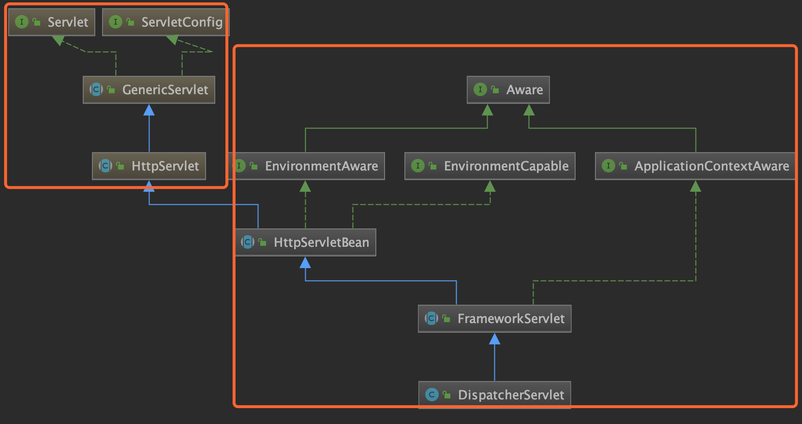
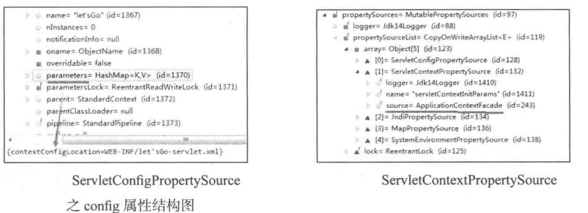
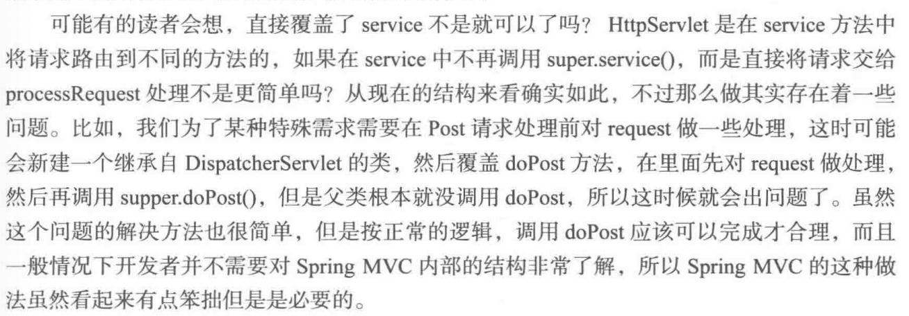
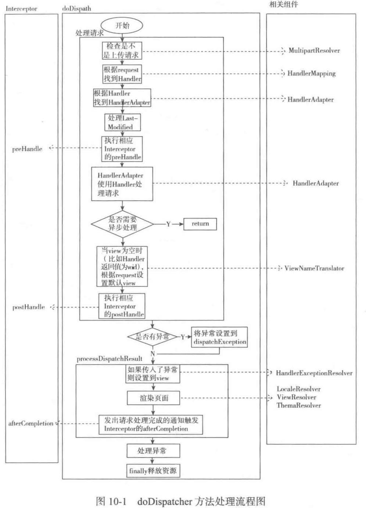

# 1 Spring MVC创建过程

​	先分析Spring MVC的整体结构，然后具体分析每层的创建过程

## 1.1 SpringMvc整体结构介绍

​	Spring MVC中核心Servlet的继承结构图，分为java左边部分和spring右边部分



​	Servlet的继承结构中共有五个类，GenericServlet和HttpServlet在Servlet中说过，HttpServletBean、FrameWorkServlet和DispatcherServlet是Spring MVC中的。

​	这三个类直接实现三个接口：EnvironmentAware、EnvironmentCapable和ApplicationContextAware。

###EnvironmentAware接口

​	EnvironmentAware接口只有一个**setEnvironment(Environment)**方法，HttpServletBean实现了EnvironmentAware接口，spring会自动调用setEnvironment(Environment)传入Environment属性

```java
public abstract class HttpServletBean extends HttpServlet implements EnvironmentCapable, EnvironmentAware {
@Override
public void setEnvironment(Environment environment) {
   Assert.isInstanceOf(ConfigurableEnvironment.class, environment, "ConfigurableEnvironment required");
   this.environment = (ConfigurableEnvironment) environment;
}
```

> ​	XXAware在spring里表示对XX类可以感知：如果在xx类里使用spring的东西，可以通过实现xxAware接口告诉spring，spring会送过来，接收的方式通过实现接口唯一的方法set-xx

###EnvironmentCapable接口

​	EnvironmentCapable意思是具有Environment的能力，可以提供Environment，EnvironmentCapable唯一的方法是Environment getEnvironment();

​	实现EnvironmentCapable接口的类就是告诉spring它可以提供Environment，当spring需要Environment时会调用它的getEnvironment方法跟它要

ApplicatonContext和Environment

​	应用程序上下文和环境，在HttpServletBean中Environment使用的是StandardServletEnvironment(在createEnvironment方法中创建)，这里封装了**ServletContext**和**ServletConfig**、**JndiProperty**、**系统环境变量**和**系统属性**，这些都封装在**propertySources属性**下。

```java
HttpServletBean
  
protected ConfigurableEnvironment createEnvironment() {
   return new StandardServletEnvironment();
}
```

​	ServletConfigPropertySource的类型是StandardWrapperFacade，是Tomcat里定义的ServletConfig类型，所以，ServletConfigPropertySource封装的就是ServletConfig。

​	web.xml定义的contextConfigLocation可以在config下的parameters看到，config其实是Tomcat中StandardWrapper——存放Servlet的容器。

​	ServletContextProprtySource中保存的ServletContext

​	

​	JndiPropertySource存放的是Jndi	

​	MapPropertySource存放的是虚拟机的属性，如Java版本、操作系统的名字、版本等

​	SystemEnvironmentPropertySource存放的是环境变量，Java_home、path等属性

##1.2 HttpServletBean

​	Servlet创建时可以直接调用无参数的init方法

```java
public final void init() throws ServletException {
  	//将servlet中配置的参数封装到pvs变量中，requiredProperties必须参数，否则报错
    PropertyValues pvs = new HttpServletBean.ServletConfigPropertyValues(this.getServletConfig(), this.requiredProperties);
    if (!pvs.isEmpty()) {
        try {
            BeanWrapper bw = PropertyAccessorFactory.forBeanPropertyAccess(this);
            ResourceLoader resourceLoader = new ServletContextResourceLoader(this.getServletContext());
            bw.registerCustomEditor(Resource.class, new ResourceEditor(resourceLoader, this.getEnvironment()));
            //模版方法，可以在子类调用，做些初始化工作，bw代表DispatcherServlet
            this.initBeanWrapper(bw);
          	//将配置的初始化值设置到DispatcherServlet
            bw.setPropertyValues(pvs, true);
        } catch (BeansException var4) {
        }
    }
    //模版方法，子类初始化的入口方法
    this.initServletBean();
}
```

​	在HttpServletBean的init中，首先将Servlet中配置的参数使用BeanWeapper设置到DispatcherServlet的相关属性，然后调用模版方法initServletBean，子类通过该方法初始化

> ​	BeanWrapper是Spring提供的用来操作JavaBean属性的工具，可以修改一个对象的属性
>
> ​	User user = new User();
>
>    BeanWrapper bw = PropertyAccessorFactory.forBeanPropertyAccess(user);
>
> ​    bw.setPropertyValue("username","zhangsan");

## 1.3 FrameworkServlet

​	FrameworkServlet的初始化入口方法就是上面HttpServletBean中init方法里最后调用的initServletBean方法

```java
protected final void initServletBean() throws ServletException {
        this.webApplicationContext = this.initWebApplicationContext();
        this.initFrameworkServlet();
}
```

​	核心代码只有两句，初始化WebApplicationContext和初始化initFrameworkServlet(模版方法，子类可以覆盖，但子类没有使用它)。

​	所以FrameworkServlet在构建的过程主要就是初始化了initWebApplicationContext	

​	initWebApplicatoinContext方法做了三件事

		1. 获取spring的根容器rootContext
  		2. 设置webApplicationContext并根据情况调用onRefresh方法
  		3. 将webApplicationContext设置到ServletContext中

```java
protected WebApplicationContext initWebApplicationContext() {
    WebApplicationContext rootContext = WebApplicationContextUtils.getWebApplicationContext(this.getServletContext());
    WebApplicationContext wac = null;
  	//如果已经通过构造方法设置了webApplicationContext
    if (this.webApplicationContext != null) {
        wac = this.webApplicationContext;
        if (wac instanceof ConfigurableWebApplicationContext) {
            ConfigurableWebApplicationContext cwac = (ConfigurableWebApplicationContext)wac;
            if (!cwac.isActive()) {
                if (cwac.getParent() == null) {
                    cwac.setParent(rootContext);
                }
                this.configureAndRefreshWebApplicationContext(cwac);
            }
        }
    }
    if (wac == null) {
        //当webApplicationContext已经存在ServletContext中时，通过配置在Servlet中的contextAttribute参数获取
        wac = this.findWebApplicationContext();
    }
    if (wac == null) {
      	//如果webApplicationContext还没创建，根据rootContext创建
        wac = this.createWebApplicationContext(rootContext);
    }
    if (!this.refreshEventReceived) {
        //当ContextRefreshedEvent事件还没有触发时调用次方法，模版方法，子类可以重写
        this.onRefresh(wac);
    }
    if (this.publishContext) {
        String attrName = this.getServletContextAttributeName();
        //将ApplicationContext保存到ServletContext中
        this.getServletContext().setAttribute(attrName, wac);
    }
    return wac;
}
```

###获取Spring的根容器rootContext

​	默认情况spring会将自己的容器设置成ServletContext的属性，默认根容器的key为org.springframework.web.context.WebApplicationContext.ROOT，定义在WebApplicationContext中。

​	所以获取根容器只需要调用ServletContext的getArrtibute就可以

​	ServletContext # getAttribute("org.springframework.web.context.WebApplicationContext.ROOT");

### 设置webApplicationContext并根据情况调用onRefresh方法

​	设置webApplicationContext共有三种方法：

 1. 在构造方法中传递webApplicationContext参数，只需要对其设置即可。该方法主要用于Servlet3.0后的环境，Servlet3.0后可以在程序中使用ServletContext.addServlet方式注册Servlet，就可以在新建FrameworkServlet和其子类时通过构成方法传递已经准备好的webApplicationContext

 2. webApplicationContext已经在ServletContext中，这时只需要在配置Servlet时将ServletContext中的webApplicationContext的name配置到contextAttribute属性即可。

 3. 在前两种无效情况下自己创建一个。正常情况下使用这个方式。创建过程在createWebApplicationContext方法中，createWebApplicationContext内部又调用了configureAndRefreshWebApplicationContext方法。

       首先调用getContextClass方法获取创建的类型，可以通过contextClass属性设置到Servlet中，默认使用org.springframework.web.context.support.XmlWebApplicationContext。

    ​	然后检查属不属于ConfigurableWebApplicationContext类型，不属于抛异常

    ​	接下来根据BeanUtils.instantiateClass（contextClass）进行创建

    ​	将设置的contextConfigLocation参数传入，默认传入WEB-INFO/[ServletName]-Servlet.xml，然后进行配置。

    ​	configureAndRefreshWebApplicationContext方法中添加监听ContextRefreshedEvent的监听器，可以根据传入的参数进行选择，实际监听的事ContextRefreshListener所监听的事件

    ```java
    protected WebApplicationContext createWebApplicationContext(ApplicationContext parent) {
      	//获取创建类型
        Class<?> contextClass = this.getContextClass();
      	//检查创建类型
        if (!ConfigurableWebApplicationContext.class.isAssignableFrom(contextClass)) {
        } else {
          	//具体创建
            ConfigurableWebApplicationContext wac = (ConfigurableWebApplicationContext)BeanUtils.instantiateClass(contextClass);
            wac.setEnvironment(this.getEnvironment());
            wac.setParent(parent);
            //将设置的contextConfigLocation参数传给wac，默认传入WEB-INFO/[ServletName]-Servlet.xml
            wac.setConfigLocation(this.getContextConfigLocation());
            this.configureAndRefreshWebApplicationContext(wac);
            return wac;
        }
    }
    ```

```java
protected void configureAndRefreshWebApplicationContext(ConfigurableWebApplicationContext wac) {
    if (ObjectUtils.identityToString(wac).equals(wac.getId())) {
        if (this.contextId != null) {
            wac.setId(this.contextId);
        } else {
            wac.setId(ConfigurableWebApplicationContext.APPLICATION_CONTEXT_ID_PREFIX + ObjectUtils.getDisplayString(this.getServletContext().getContextPath()) + '/' + this.getServletName());
        }
    }
    wac.setServletContext(this.getServletContext());
    wac.setServletConfig(this.getServletConfig());
    wac.setNamespace(this.getNamespace());
  	//添加监听ContextRefreshedEvent的监听器
    wac.addApplicationListener(new SourceFilteringListener(wac, new FrameworkServlet.ContextRefreshListener()));
    ConfigurableEnvironment env = wac.getEnvironment();
    if (env instanceof ConfigurableWebEnvironment) {
        ((ConfigurableWebEnvironment)env).initPropertySources(this.getServletContext(), this.getServletConfig());
    }
    this.postProcessWebApplicationContext(wac);
    this.applyInitializers(wac);
    wac.refresh();
}
```

​	ContextRefreshListener是FrameworkServlet的内部类，监听ContxtRefreshedEvent事件，当接收到消息时调用FrameworkServlet的onApplicationEvent方法，在onApplicationEvent方法中会调用一次onRefresh方法，并将refreshEventReceived标志设置为true，表示已经refresh

```java
 class ContextRefreshListener implements ApplicationListener<ContextRefreshedEvent> {
        public void onApplicationEvent(ContextRefreshedEvent event) {
            FrameworkServlet.this.onApplicationEvent(event);
        }
    }
    
public void onApplicationEvent(ContextRefreshedEvent event) {
    this.refreshEventReceived = true;
    this.onRefresh(event.getApplicationContext());
}
```

​	当使用第三种方法初始化时已经refresh，不需要再调用onRefresh。第一种也调用了ConfigureAndRefreshWebApplication方法，也refresh过，所以只有使用第二种方式初始化时webApplicationContext时才会在这里调用onRefresh方法。

​	不管哪种方式，onRefresh最终肯定只会调用一次，且DispatcherServlet时通过重写这个模版方法实现初始化的。

### 将webApplicationContext设置到ServletContext中

​	根据publishContext标志判断是否将创建的webApplicationContext设置到ServletContext的属性中，publishContext标志可以在配置Servlet时通过init-param参数设置，HttpServletBean初始化时会将其设置到publishContext参数。

​	将webApplicationContext设置到ServletContext的属性中为了方便获取

> ​	配置Servlet时可以设置的一些初始化参数
>
> ​	contextAttribute：在ServletContext的属性中，用作WebApplicationContext的属性名称
>
> ​	contextClass：创建WebApplicationContext的类型
>
> ​	contextConfigLocation：Spring MVC配置文件的位置
>
> ​	publicshContext：是否将webApplicationContext设置到ServletContext的属性

## 1.4 DispatcherServlet

​	onRefresh方法是DispatcherServlet的入口方法。 onRefresh中简单调用了initStrategies，在initStrategies中调用了九个初始化方法。

​	分为两个方法为了层次清晰 刷新容器和初始化

```java
#DispatcherServlet

protected void onRefresh(ApplicationContext context) {
    this.initStrategies(context);
}

protected void initStrategies(ApplicationContext context) {
    this.initMultipartResolver(context);
    this.initLocaleResolver(context);
    this.initThemeResolver(context);
    this.initHandlerMappings(context);
    this.initHandlerAdapters(context);
    this.initHandlerExceptionResolvers(context);
    this.initRequestToViewNameTranslator(context);
    this.initViewResolvers(context);
    this.initFlashMapManager(context);
}
```

​	initLocaleResolver初始化分为两部分

​		首先通过context.getBean在容器里面按注册时的名称或类型，这里是名称localeResolver进行查找。

​		如果找不到就调用getDefaultStrategy方法按照类型LocaleResolver获取默认的组件

​		context 是FrameworkServlet中创建的WebApplicationContext，而不是ServletContext。

```java
private void initLocaleResolver(ApplicationContext context) {
    try {
        this.localeResolver = (LocaleResolver)context.getBean("localeResolver", LocaleResolver.class);
       
    } catch (NoSuchBeanDefinitionException var3) {
        this.localeResolver = (LocaleResolver)this.getDefaultStrategy(context, LocaleResolver.class);
    }
}
```

​	getDefaultStrategy方法通过调用getDefaultStrategy重载返回list的方法，不为空取第一个LocaleResolver。

​	因为HandlerMapping等组件可以有多个，所以返回list

```java
protected <T> T getDefaultStrategy(ApplicationContext context, Class<T> strategyInterface) {
    List<T> strategies = this.getDefaultStrategies(context, strategyInterface);
    if (strategies.size() != 1) {
    } else {
        return strategies.get(0);
    }
}

protected <T> List<T> getDefaultStrategies(ApplicationContext context, Class<T> strategyInterface) {
        String key = strategyInterface.getName();
  			//从DefaultStrategies获取所需策略的类型
        String value = defaultStrategies.getProperty(key);
        if (value == null) {
            return new LinkedList();
        } else {
          	//如果有多个默认值，根据都好分割为数组
            String[] classNames = StringUtils.commaDelimitedListToStringArray(value);
            List<T> strategies = new ArrayList(classNames.length);
            String[] var7 = classNames;
            int var8 = classNames.length;
						//按照取到的类型初始化策略
            for(int var9 = 0; var9 < 	、var8; ++var9) {
                String className = var7[var9];
                try {
                    Class<?> clazz = ClassUtils.forName(className, DispatcherServlet.class.getClassLoader());
                    Object strategy = this.createDefaultStrategy(context, clazz);
                    strategies.add(strategy);
                } catch (ClassNotFoundException var13) {
                } catch (LinkageError var14) {
                }
            }
            return strategies;
        }
    }
```

​	上面方法defaultStrategies.getProperty(key)是如何来的，就可以理解默认初始化的方式。

​	defaultStrategies里存放的是org.springframework.web.DispatcherServlet.properties里定义的键值

```java
    private static final Properties defaultStrategies;
static {
    try {
        ClassPathResource resource = new ClassPathResource("DispatcherServlet.properties", DispatcherServlet.class);
        defaultStrategies = PropertiesLoaderUtils.loadProperties(resource);
    } catch (IOException var1) {
        throw new IllegalStateException("Could not load 'DispatcherServlet.properties': " + var1.getMessage());
    }
}
```

​	该文件定义了不同组件的类型，上传组件MultipartResolver没有默认配置。这九个配置就是onRefresh里面初始化的九个方法。

​	HandlerMapping、HandlerAdapter、HandlerExceptionResolver都配置了多个

> ​		默认配置不是最优配置，只是在没有配置时候又个默认值。可能有些已经弃用了。
>
> ​		默认配置只有自相应类型没有配置时才会使用。
>
> ​		<mvc:annotation-driven/>不会使用默认配置，因为它配置了HandlerMapping、HandlerAdapter、HandlerExceptionResolver

```properties
# Default implementation classes for DispatcherServlet's strategy interfaces.
# Used as fallback when no matching beans are found in the DispatcherServlet context.
# Not meant to be customized by application developers.
org.springframework.web.servlet.LocaleResolver=org.springframework.web.servlet.i18n.AcceptHeaderLocaleResolver

org.springframework.web.servlet.ThemeResolver=org.springframework.web.servlet.theme.FixedThemeResolver

org.springframework.web.servlet.HandlerMapping=org.springframework.web.servlet.handler.BeanNameUrlHandlerMapping,\
   org.springframework.web.servlet.mvc.annotation.DefaultAnnotationHandlerMapping

org.springframework.web.servlet.HandlerAdapter=org.springframework.web.servlet.mvc.HttpRequestHandlerAdapter,\
   org.springframework.web.servlet.mvc.SimpleControllerHandlerAdapter,\
   org.springframework.web.servlet.mvc.annotation.AnnotationMethodHandlerAdapter

org.springframework.web.servlet.HandlerExceptionResolver=org.springframework.web.servlet.mvc.annotation.AnnotationMethodHandlerExceptionResolver,\
   org.springframework.web.servlet.mvc.annotation.ResponseStatusExceptionResolver,\
   org.springframework.web.servlet.mvc.support.DefaultHandlerExceptionResolver

org.springframework.web.servlet.RequestToViewNameTranslator=org.springframework.web.servlet.view.DefaultRequestToViewNameTranslator

org.springframework.web.servlet.ViewResolver=org.springframework.web.servlet.view.InternalResourceViewResolver

org.springframework.web.servlet.FlashMapManager=org.springframework.web.servlet.support.SessionFlashMapManager
```

​	

​	本节分析了Spring MVC自身的创建过程，Spring MVC中Servlet共有三个层次，分别是HttpServletBean、FrameworkServlet和DispatcherServlet。

​	HttpServletBean直接继承自Java的HttpServlet，作用是将Servlet中配置的参数设置到相应的属性

​	FrameworkServlet初始化了WebApplicationContext，共有三种方式

​	DispatcherServlet初始化了自身的九个组件


# 2 Spring MVC 处理请求

​	本节分析Spring MVC如何处理请求的。分为两步：

1. 首先分析HttpServletBean、FrameworkServlet和DispatcherServlet的处理过程，可以明白从Servlet容器将请求交给Spring MVC一直到DispatcherServlet具体处理请求前都做了些什么

 	2. 重点分析Spring MVC中最核心的处理方法doDispatch的结构

### 2.1 HttpServletBean

​    HttpServletBean主要参与了创建工作，在处理请求中没有涉及相应的请求处理。

### 2.2 FrameworkServlet

​    Servlet处理过程：从Servlet的service方法开始，然后在HttpServlet的service方法中根据不同类型将请求路由到doGet、doHead、doPost、doPut、doDelete、doOption、doTrace，并做了doHead、doOption、doTrace的默认实现，doHead调用了doGet，返回只有header没有body的response。

​    FrameworkServlet重写了service、doGet、doPost、doPut、doDelete、doOptions、doTrace，在service增加了对PATCH类型的处理，其他类型的请求直接交给父类进行处理；doOptions和doTrace可以设置是否交给父类处理(默认都是交给父类处理，doOptions会在父类的处理结果中增加PATCH类型)；doGet、doPost、doPut和doDelete都是自己处理。所有需要自己处理的请求都交给了processRequest方法进行统一处理。

​    以下是service和doGet的代码：

```java
protected void service(HttpServletRequest request, HttpServletResponse response)
      throws ServletException, IOException {
   HttpMethod httpMethod = HttpMethod.resolve(request.getMethod());
   if (httpMethod == HttpMethod.PATCH || httpMethod == null) {
      processRequest(request, response);
   }
   else {
      super.service(request, response);
   }
}
protected final void doGet(HttpServletRequest request, HttpServletResponse response)
      throws ServletException, IOException {
   processRequest(request, response);
}
```

​    由上可以看出，将请求合并到processRequest中，在里面Spring MVC对不同类型的请求用不同的Handler进行处理。

​	ProcessRequest方法是FrameworkServlet类在处理请求中最核心的方法

```java
protected final void processRequest(HttpServletRequest request, HttpServletResponse response) throws ServletException, IOException {
    long startTime = System.currentTimeMillis();
    Throwable failureCause = null;
  	//获取localContextHolder中原来保存的localContext
    LocaleContext previousLocaleContext = LocaleContextHolder.getLocaleContext();
  	//获取当前的localContext
    LocaleContext localeContext = this.buildLocaleContext(request);
  	//获取RequestContextHolder中原来保存的RequestAttributes
    RequestAttributes previousAttributes = RequestContextHolder.getRequestAttributes();
  	//获取当前请求的ServletRequestAttributes
    ServletRequestAttributes requestAttributes = this.buildRequestAttributes(request, response, previousAttributes);
    WebAsyncManager asyncManager = WebAsyncUtils.getAsyncManager(request);
    asyncManager.registerCallableInterceptor(FrameworkServlet.class.getName(), new FrameworkServlet.RequestBindingInterceptor());
  	//当前的localContext和当前请求的ServletRequestAttributes设置到localContextHolder和RequestContextHolder
    this.initContextHolders(request, localeContext, requestAttributes);
    try {
      	//实际处理请求入口
        this.doService(request, response);
    } catch (ServletException var17) {
        failureCause = var17;
        throw var17;
    } catch (IOException var18) {
        failureCause = var18;
        throw var18;
    } catch (Throwable var19) {
        failureCause = var19;
        throw new NestedServletException("Request processing failed", var19);
    } finally {	
      	//处理完恢复原来的localContext和ServletRequestAttributes到localContextHolder和RequestContextHolder
        this.resetContextHolders(request, previousLocaleContext, previousAttributes);
        if (requestAttributes != null) {
            requestAttributes.requestCompleted();
        }
      	//发布ServletRequestHandledEvent消息
        this.publishRequestHandledEvent(request, response, startTime, (Throwable)failureCause);
    }
}
```

​	processRequest方法中的核心语句是doService(request, response),模版方法，在DispatcherServlet中具体实现。

​	processRequest自己主要做了两件事

  		1. 对localContext和ServletRequestAttributes的设置及恢复
  		2. 处理完后发布ServletRequestHandledEvent消息

​    LocaleContext:存放着Locale（本地化信息）；RequestAttributes：是spring的一个接口，通过它可以get/set/removeAttribute，根据scope参数判断操作request还是session，具体使用的是ServletRequestAttributes，ServletRequestAttributes里面封装了request、response、session，通过get就可以获得。

​	ServletRequestAttributes的setAttribute方法，设置属性时通过scope判断是对request还是session进行设置，isRequestActive()，当调用了ServletRequestAttributes的requestCompleted方法后requestActive就会变为false，之前是true。

> ​	因为request执行完了，不能再对它进行操作了，上面的finally块已调用requestAttributes.requestCompleted()的方法

```java
public void setAttribute(String name, Object value, int scope) {
    if (scope == 0) {
      	if (!this.isRequestActive()) {
                throw new IllegalStateException("Cannot set request attribute - request is not active anymore!");
            }
        this.request.setAttribute(name, value);
    } else {
        HttpSession session = this.getSession(true);
        this.sessionAttributesToUpdate.remove(name);
        session.setAttribute(name, value);
    }
}
```

​    LocaleContext可以获取Locale

​	RequestAttributes用于管理request和session的属性

​	LocaleContextHolder，是抽象类，里面的方法是static的，可以直接使用。没有父类和子类，不能对它实例化。

```java
public abstract class LocaleContextHolder {
    private static final ThreadLocal<LocaleContext> localeContextHolder = new NamedThreadLocal("Locale context");
    private static final ThreadLocal<LocaleContext> inheritableLocaleContextHolder = new NamedInheritableThreadLocal("Locale context");
```

​	   LocaleContextHolder类里面封装了两个属性localeContextHolder和inheritableLocaleContextHolder，都是LocalContext，其中第二个可以被子线程继承。localeContextHolder提供了get/set方法，可以获取和设置localeContext。另外还提供了get/setLocale方法，可以直接操作Locale，都是static的。

​	 RequestContextHolder也是一样的道理。封装了RequestAttributes，可以get/set/removeAttribute，因为实际封装的ServletRequestAttributes，还可以getRequest、getResponse、getSession，就可以在任何地方获取这些对象了。

​	最后发布 this.publishRequestHandledEvent(request, response, startTime, (Throwable)failureCause)发布ServletRequestHandledEvent消息

​	当publishEvents设置为true时，请求处理结束后就会发出这个消息，无论请求处理成功与否都会发布。publishEvents在web.xml中和Spring MVC的Servlet中可以配置，默认为true。

```java
private void publishRequestHandledEvent(HttpServletRequest request, HttpServletResponse response, long startTime, Throwable failureCause) {
    if (this.publishEvents) {
        long processingTime = System.currentTimeMillis() - startTime;
        int statusCode = responseGetStatusAvailable ? response.getStatus() : -1;
        this.webApplicationContext.publishEvent(new ServletRequestHandledEvent(this, request.getRequestURI(), request.getRemoteAddr(), request.getMethod(), this.getServletConfig().getServletName(), WebUtils.getSessionId(request), this.getUsernameForRequest(request), processingTime, failureCause, statusCode));
    }
}
```

​    FrameworkServlet工作流程：首先，在service方法中添加对PATCH的处理，并将所需要自己处理的请求集中到processRequest进行统一处理。然后，processRequest将处理逻辑交给模板方法doService，在doService的的前后使用request获取LocaleContexthe和RequestAttributes进行保存，处理完之后恢复。最后，发布ServletRequesthandledEvent事件。

### 2.3 DispatcherServlet

​    DispatcherServlet里面执行处理的入口方法是doService。doService将处理交给doDispatch进行具体处理，在doDispatch处理前doService做了一些事情：首先判断是不是include请求，如果是则对request的Attribute做个快照备份，等doDispatch处理完之后进行还原，在做完快照后又对request设置了一些属性

```java
protected void doService(HttpServletRequest request, HttpServletResponse response) throws Exception {
    if (this.logger.isDebugEnabled()) {
        String resumed = WebAsyncUtils.getAsyncManager(request).hasConcurrentResult() ? " resumed" : "";
    }
  	// 当include请求时对request的Attribute做快照备份
    Map<String, Object> attributesSnapshot = null;
    if (WebUtils.isIncludeRequest(request)) {
        attributesSnapshot = new HashMap();
        Enumeration attrNames = request.getAttributeNames();
        label108:
        while(true) {
            String attrName;
            do {
                if (!attrNames.hasMoreElements()) {
                    break label108;
                }
                attrName = (String)attrNames.nextElement();
            } while(!this.cleanupAfterInclude && !attrName.startsWith("org.springframework.web.servlet"));

            attributesSnapshot.put(attrName, request.getAttribute(attrName));
        }
    }
		// 对request设置一些属性
    request.setAttribute(WEB_APPLICATION_CONTEXT_ATTRIBUTE, this.getWebApplicationContext());
    request.setAttribute(LOCALE_RESOLVER_ATTRIBUTE, this.localeResolver);
    request.setAttribute(THEME_RESOLVER_ATTRIBUTE, this.themeResolver);
    request.setAttribute(THEME_SOURCE_ATTRIBUTE, this.getThemeSource());
    FlashMap inputFlashMap = this.flashMapManager.retrieveAndUpdate(request, response);
    if (inputFlashMap != null) {
        request.setAttribute(INPUT_FLASH_MAP_ATTRIBUTE, Collections.unmodifiableMap(inputFlashMap));
    }

    request.setAttribute(OUTPUT_FLASH_MAP_ATTRIBUTE, new FlashMap());
    request.setAttribute(FLASH_MAP_MANAGER_ATTRIBUTE, this.flashMapManager);

    try {
        this.doDispatch(request, response);
    } finally {
      	// 还原request快照的属性
        if (!WebAsyncUtils.getAsyncManager(request).isConcurrentHandlingStarted() && attributesSnapshot != null) {
            this.restoreAttributesAfterInclude(request, attributesSnapshot);
        }
    }
}
```

   对request设置的属性中，前面4个属性webApplicationContext、localeResolver、themeResolver和themeSource在Handler和view中使用。后面3个属性都和flashMap相关，主要用于Redirect转发是参数的传递。

​    doDispatch的核心代码：（1）根据request找到Handler  (2)根据Handler找到对应的HandlerAdapter  (3)用HandlerAdapter处理Handler  （4）调用processDispatchResult方法处理上面处理之后的返回结果(包括找到View并渲染输出给用户)。

```java
mappedHandler = this.getHandler(processedRequest);
HandlerAdapter ha = this.getHandlerAdapter(mappedHandler.getHandler());
mv = ha.handle(processedRequest, response, mappedHandler.getHandler());
 this.processDispatchResult(processedRequest, response, mappedHandler, mv, (Exception)dispatchException);
```

​    Hanlder :处理器，标注了@RequestMapping的类或者方法，直接对应MVC中的Controller

​    HandlerMapping : 根据请求查找Handler，

​    handlerAdapter ：适配器，调用具体的Handler对请求进行处理。

​	Hanlder相关与设备，HandlerMapping根据需求选择不同的设备，handlerAdapter具体操作设备的工人，不同的设备需要不同的工人。

​	View和ViewResolver的原理与Handler与HandlerMapping的原理类似。View用来展示数据的，ViewResolver用来查找View。

###2.4 DoDispatch结构



详细分析doDispatch内部的结构及处理的流程

```java
protected void doDispatch(HttpServletRequest request, HttpServletResponse response) throws Exception {
    HttpServletRequest processedRequest = request;
    HandlerExecutionChain mappedHandler = null;
    boolean multipartRequestParsed = false;
    WebAsyncManager asyncManager = WebAsyncUtils.getAsyncManager(request);

    try {
        try {
            ModelAndView mv = null;
            Object dispatchException = null;

            try {
              	//检查是不是上传请求
                // 是上传资源的话将request转换为multipartHttpServletRequest
                processedRequest = this.checkMultipart(request);
                multipartRequestParsed = processedRequest != request;
                //根据request找到Handler
              	mappedHandler = this.getHandler(processedRequest);
                if (mappedHandler == null || mappedHandler.getHandler() == null) {
                    this.noHandlerFound(processedRequest, response);
                    return;
                }
								//根据Handler找到HandlerAdapter
                HandlerAdapter ha = this.getHandlerAdapter(mappedHandler.getHandler());
              	//处理GET、HEAD请求的Last-Modified
                String method = request.getMethod();
                boolean isGet = "GET".equals(method);
                if (isGet || "HEAD".equals(method)) {
                    long lastModified = ha.getLastModified(request, mappedHandler.getHandler());
                    if (this.logger.isDebugEnabled()) {
                        this.logger.debug("Last-Modified value for [" + getRequestUri(request) + "] is: " + lastModified);
                    }

                    if ((new ServletWebRequest(request, response)).checkNotModified(lastModified) && isGet) {
                        return;
                    }
                }
								// 执行相应Interceptor的preHandle
                if (!mappedHandler.applyPreHandle(processedRequest, response)) {
                    return;
                }
								//HandlerAdapter使用Handler处理请求
                mv = ha.handle(processedRequest, response, mappedHandler.getHandler());
              	// 如果需要异步处理，直接返回
                if (asyncManager.isConcurrentHandlingStarted()) {
                    return;
                }
								// 当view为空时，根据request设置默认view
                this.applyDefaultViewName(processedRequest, mv);
                //执行相应Interceptor的postHandle
                mappedHandler.applyPostHandle(processedRequest, response, mv);
            } catch (Exception var20) {
                dispatchException = var20;
            } catch (Throwable var21) {
                dispatchException = new NestedServletException("Handler dispatch failed", var21);
            }
						// 处理返回结果。包括处理异常、渲染页面、发出完成通知触发Interceptor的afterCompletion
            this.processDispatchResult(processedRequest, response, mappedHandler, mv, (Exception)dispatchException);
        } catch (Exception var22) {
            this.triggerAfterCompletion(processedRequest, response, mappedHandler, var22);
        } catch (Throwable var23) {
            this.triggerAfterCompletion(processedRequest, response, mappedHandler, new NestedServletException("Handler processing failed", var23));
        }

    } finally {
      	// 判断是否执行异步请求
        if (asyncManager.isConcurrentHandlingStarted()) {
            if (mappedHandler != null) {
             mappedHandler.applyAfterConcurrentHandlingStarted(processedRequest, response);
            }
          // 删除上传请求的资源
        } else if (multipartRequestParsed) {
            this.cleanupMultipart(processedRequest);
        }
    }
}
```

doDispatch分为两部分：处理请求和渲染页面。开头定义了几个变量

> ​	HttpServletRequest processedRequest：实际处理时所用的request，如果不是上传请求则直接使用接收到的request，否则封装为上传类型的request
>
> ​	HandlerExecutionChain mappedHandler：处理请求的处理器链(包含处理器和对应的Interceptor)
>
> ​	Boolean multipartRequestParsed：是不是上传请求的标志
>
> ​	ModelAndView mv：封装Model和View的容器
>
> ​	Exception dispatchException：处理请求过程中抛出的异常。不包含渲染过程抛出的异常	

​	doDispatch中首先检查是不是上传请求，是则将request转换为multipartHttpServletRequest，并将multipartRequestParsed标志设置为true。其中使用了MultipartResolver。

​	然后通过getHandler方法获取Handler处理器链，使用HandlerMapping返回值为HandlerExecutionChain类型，其中包含与当前request相匹配的Interceptor和Handler。

```java
protected HandlerAdapter getHandlerAdapter(Object handler) throws ServletException {
    Iterator var2 = this.handlerAdapters.iterator();
    HandlerAdapter ha;
    do {
        if (!var2.hasNext()) {
            throw new ServletException("No adapter for handler [" + handler + "]: The DispatcherServlet configuration needs to include a HandlerAdapter that supports this handler");
        }
        ha = (HandlerAdapter)var2.next();
        if (this.logger.isTraceEnabled()) {
            this.logger.trace("Testing handler adapter [" + ha + "]");
        }
    } while(!ha.supports(handler));
    return ha;
}
```

​	方法结构非常简单，HandlerExecutionChain的类型类似前面Tomcat中的Pipeline，Interceptor和Handler相当于Value和BaseValue，执行时先一次执行Interceptor的preHandle方法，最后执行Handler，返回时按相反的顺序执行Interceptor的postHandle方法。

​	接下来处理Get、HEAD请求的Last-Modified。当浏览器第一次根服务器请求资源(GET、Head请求)时，服务器在返回的请求头里包含一个Last-Modified的属性，代表本资源最后是什么时候修改的。浏览器以后发送请求时会同时发送之前接收到的Last-Modified，服务器接收到带Last-Modified的请求后会用其值和自己实际资源的最后修改事件做对比，如果资源过期了则返回新的资源(同时返回新的Last-Modified)，否则直接返回304状态吗表示资源为过期，浏览器直接使用之前缓存的结果。

​	接下来依次调用相应Interceptor的preHandle。

​	处理完Interceptor的preHandle后就到了此方法最关键的地方—让HandlerAdapter使用Handler处理请求，Controller就是在这个地方执行的。这里主要使用了HandlerAdapter。

​	Handler处理完请求后，如果需要异步处理，则直接返回，如果不需要异步处理，当view为空时(如Handler返回值为void)，设置默认view，然后执行相应Interceptor的postHandle。设置默认view的过程中使用到了ViewNameTranslator。

​	结下来使用processDispatchResult方法处理前面返回的结果，其中包括处理异常、渲染页面、触发Interceptor的afterCompletion方法三部分内容。

​	doDispatch的异常处理结构。doDispatch有两层异常捕获，内层是捕获在对请求进行处理的过程中抛出的异常，外层主要是在处理渲染页面时抛出的。

​	内层的异常就是执行请求处理时的异常会设置到dispatchException变量，然后在processDispatchResult方法中进行处理，外层则是处理processDispatchResult方法抛出的异常。processDispatchResult代码如下

```java
private void processDispatchResult(HttpServletRequest request, HttpServletResponse response, HandlerExecutionChain mappedHandler, ModelAndView mv, Exception exception) throws Exception {
    boolean errorView = false;
  	// 如果请求处理的过程中有异常抛出则处理异常
    if (exception != null) {
        if (exception instanceof ModelAndViewDefiningException) {
            this.logger.debug("ModelAndViewDefiningException encountered", exception);
            mv = ((ModelAndViewDefiningException)exception).getModelAndView();
        } else {
            Object handler = mappedHandler != null ? mappedHandler.getHandler() : null;
            mv = this.processHandlerException(request, response, handler, exception);
            errorView = mv != null;
        }
    }	
  	// 渲染页面
    if (mv != null && !mv.wasCleared()) {
        this.render(mv, request, response);
        if (errorView) {
            WebUtils.clearErrorRequestAttributes(request);
        }
    } else if (this.logger.isDebugEnabled()) {
    }
    if (!WebAsyncUtils.getAsyncManager(request).isConcurrentHandlingStarted()) {		 // 发出请求处理完成的通知，触发Interceptor的afterCompletion
        if (mappedHandler != null) {
            mappedHandler.triggerAfterCompletion(request, response, (Exception)null);
        }
    }
}
```

​		processDispatchResult处理异常的方式其实就是将相应的错误页面设置到View，在其中的processHandlerException方法中用到了HandlerExceptionResolver。

​	渲染页面具体在render方法中执行，render中首先对response设置了Local，过程中使用到了LocalResolver，然后判断View如果是String类型则调用resolveViewName方法使用ViewResolver得到实际的View，最后调用View的render方法对页面进行具体渲染，渲染的过程中使用到了ThemeResolver。

​	最后通过mappedHandler的triggerAfterCompletion方法触发Interceptor的afterCompletion方法，这里的Interceptor也是按反方向执行的。到这里processDispatchResult方法就执行完了。

​	再返回doDispatch方法中，在最后的finally中判断是否请求启动了异步处理，如果启动了则调用相应异步处理的拦截器，否则如果是上传请求则删除上传请求过程中产生的临时资源。	

#小结

​	分析了Spring MVC中请求处理的过程。首先对三个Servlet进行分析，然后单独分析DispatcherServlet中的doDispatch方法。

​	三个Servlet的处理过程大致功能如下：

​		HttpServletBean：没有参与实际请求的处理

​		FrameworkServlet：将不同类型的请求合并到了processRequest方法统一处理，processRequest方法中做了三件事：

​			调用了doService模版方法具体处理请求

​			将当前请求的LocaleContext和ServletRequestAttributes在处理请求前设置到了LocaleContextHodler和RequestContextHolder，并在请求处理完成后恢复。

​			请求处理完后发布了ServletRequestHandleEvent消息

​		DispatcherServlet：doService方法给request设置了一些属性并将请求交给doDispatch方法具体处理

​	DispatcherServlet中的doDispatch方法完成Spring MVC中请求处理过程的顶层设计，它使用DispatcherServlet中的九大组件完成了具体的请求处理。另外HandlerMapping、Handler和HandlerAdapter这三个概念的含义及它们之间的关系也非常重要。