#1 Tomcat的顶层结构及启动过程

## 1.1 Tomcat的顶层结构

​	Tomcat最顶层容器叫Server，代表整个服务器，Server中至少有一个Service，用于提供服务。

​	Service主要包含两部分：

​		**Connector**：用于处理连接相关的事情，并提供Socket与request、response的转换

​		**Container**：用于封装和管理Servlet及具体处理request请求。

   一个Tomcat中只有一个Server，一个Server可以包含多个Service，一个Service只有一个Container，但可以有多个Connector。(因为一个服务可以有多个连接，如同时提供http和https连接，也可以提供相同协议不同端口的连接)

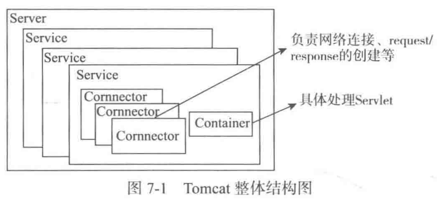

​	Tomcat中的Server由Catalina管理，Catalina是整个Tomcat的管理类，里面的三个方法load、start、stop分别管理整个服务器的生命周期，load方法用于根据Tomcat的 conf/server.xml 文件创建Server并调用Server的init方法进行初始化，start方法用于启动服务器，stop方法用于停止服务器，start和sto方法内部分别调用Server的start和stop方法，load内部调用了Server的init方法。

​	这三个方法都会按容器的结构逐层调用相应的方法，如Server的start方法中会调用所有Service中的start方法，Service中的start方法会调用所有包含的Connectors和Container的start方法，这样整个服务器就启动了。init和stop方法也一样，这就是Tomcat的生命周期的管理方式。

​	Catalina的await方法直接调用了Server的await方法，作用是进入一个循环，让主线程不会退出。

​	Tomcat的入口Bootstrap中，Bootstrap的作用类似CatalinaAdaptor，具体处理过程还是使用Catalina完成。好处是把启动的入口和具体的管理类分开，方便创建多种启动方式，每种方式只需要写一个相应的CatalinaAdaptor。

## 1.2 Bootstrap的启动过程

正常启动Tomcat调用Bootstrap的main方法，主要分为两部分：

###1.2.1 首先新建Bootstrap，并执行init方法初始化

 	init方法初始化ClassLoader，并用ClassLoader创建Catalina实例，赋给catalinaDaemon变量，后面对命令的操作都使用catalinaDaemon具体执行。

###1.2.2 处理main方法传入的命令，如果args参数为空，默认执行start

​	start命令的处理调用了三个方法：setAwait(true)、load(args)和start()。都调用了Catalina的相应方法进行具体执行，是用反射来调用的。

```java
public static void main(String[] args) {
    if (daemon == null) { // 先新建一个Bootstrap
        Bootstrap bootstrap = new Bootstrap();
        try {
            //初始化ClassLoader，并用ClassLoader创建Catalina实例，赋给catalinaDaemon变量
            bootstrap.init();
        } catch (Throwable var3) {
            handleThrowable(var3);
            var3.printStackTrace();
            return;
        }
        daemon = bootstrap;
    } else {
        Thread.currentThread().setContextClassLoader(daemon.catalinaLoader);
    }
    try {
        String command = "start";
        if (args.length > 0) {
            command = args[args.length - 1];
        }

        if (command.equals("startd")) {
            args[args.length - 1] = "start";
            daemon.load(args);
            daemon.start();
        } else if (command.equals("stopd")) {
            args[args.length - 1] = "stop";
            daemon.stop();
        } else if (command.equals("start")) {
            daemon.setAwait(true);
            daemon.load(args);
            daemon.start();
        } else if (command.equals("stop")) {
            daemon.stopServer(args);
        } else if (command.equals("configtest")) {
            daemon.load(args);
            if (null == daemon.getServer()) {
                System.exit(1);
            }
            System.exit(0);
        } else {
            log.warn("Bootstrap: command \"" + command + "\" does not exist.");
        }
    } catch (Throwable var4) {
        Throwable t = var4;
        if (var4 instanceof InvocationTargetException && var4.getCause() != null) {
            t = var4.getCause();
        }
        handleThrowable(t);
        t.printStackTrace();
        System.exit(1);
    }
}
```

​	start方法/setAwait方法/load方法——>根据反射调用catalina的start/setAwait/load方法

​	首先判断catalinaDaemon是否初始化，否则调用init方法进行初始化。然后使用Method进行反射调用Catalina的start方法。((Catalina)catalinaDaemon).start()。

> ​	Method是reflect包的类，代表一个具体的方法，可以使用其invoke方法执行代表的方法，第一个参数是Method方法所在的实体，第二个参数是可变参数，用于Method方法执行时需要的参数。

> ​	catalina.start()——>server.start()——>service.start()——>connector.start()/container.start()

```java
public void start() throws Exception {
    if (this.catalinaDaemon == null) {
        this.init();
    }
    Method method = this.catalinaDaemon.getClass().getMethod("start", (Class[])null);
    method.invoke(this.catalinaDaemon, (Object[])null);
}
 public void setAwait(boolean await) throws Exception {
        Class<?>[] paramTypes = new Class[]{Boolean.TYPE};
        Object[] paramValues = new Object[]{await};
        Method method = this.catalinaDaemon.getClass().getMethod("setAwait",paramTypes);
        method.invoke(this.catalinaDaemon, paramValues);
    }
private void load(String[] arguments) throws Exception {
        String methodName = "load";
        Object[] param;
        Class[] paramTypes;
        if (arguments != null && arguments.length != 0) {
            paramTypes = new Class[]{arguments.getClass()};
            param = new Object[]{arguments};
        } else {
            paramTypes = null;
            param = null;
        }
        Method method = this.catalinaDaemon.getClass().getMethod(methodName,paramTypes);
        if (log.isDebugEnabled()) {
            log.debug("Calling startup class " + method);
        }
        method.invoke(this.catalinaDaemon, param);
    }
```

## 1.3 Catalina的启动过程

Catalina的启动主要是调用setAwait、load和start方法完成的。

​	setAwait 方法用于设置Server启动完成后是否进入等待状态的标志，true则进入；

​	load 方法用于加载配置文件，创建并初始化Server；

​	start 方法用于启动服务器。

###1.3.1 setAwait(boolean)方法

setAwait方法设置await属性的值，await属性在start方法中 服务器启动后使用它判断是否进入等待状态。

```java
public class Catalina {
    protected static final StringManager sm = StringManager.getManager("org.apache.catalina.startup");
    protected boolean await = false;
    protected String configFile = "conf/server.xml";
  
  	public void setAwait(boolean b) {
        this.await = b;
    }
```

###1.3.2 load 方法		

​	load方法根据conf/server.xml创建Server对象，并赋值给server属性，解析操作使用Tomcat开源的Digester完成的，然后调用server的init方法

```java
public void load() {
    long t1 = System.nanoTime();
    this.initDirs();
    this.initNaming();
    Digester digester = this.createStartDigester();
    InputSource inputSource = null;
    InputStream inputStream = null;
    File file = null;
    .....
      file = this.configFile();// conf/server.xml
  		inputStream = new FileInputStream(file);
  		inputSource = new InputSource(file.toURI().toURL().toString());

  		inputSource.setByteStream((InputStream)inputStream);
  		digester.push(this);
 		  digester.parse(inputSource);
    ......
    this.getServer().setCatalina(this);
    this.getServer().setCatalinaHome(Bootstrap.getCatalinaHomeFile());
    this.getServer().setCatalinaBase(Bootstrap.getCatalinaBaseFile());
    this.initStreams();
    try {
        this.getServer().init();
    } catch (LifecycleException var24) {
    }
    long t2 = System.nanoTime();
    if (log.isInfoEnabled()) {
        log.info("Initialization processed in " + (t2 - t1) / 1000000L + " ms");
    }

}
```

### 1.3.3 start方法

Catalina的start方法主要调用了server的start方法启动服务器，并根据await属性判断是否让程序进入等待状态

 1. 先判断Server是否存在，不存在则调用load方法初始化Server

 2. 然后调用Server的start方法启动服务器

 3. 最后注册关闭钩子并根据await属性判断是否进入等待状态，由于之前设置为true，所以需要等待

 4. 进入等待状态会调用await和stop两个方法，await方法直接调用了Server的await方法，会执行一个while循环，这样程序就停在await方法，当await方法的while循环退出时，就会执行stop方法，从而关闭服务器。

    ```
    server的await方法里，while循环根据volatile类型的stopAwait是否为true停止，默认false，一直循环
    ```

```java
public void start() {
        if (this.getServer() == null) {
            this.load();
        }
				.....    
			  try {
            this.getServer().start();
        } catch (LifecycleException var7) {
            try {
                this.getServer().destroy();
            } 
            return;
        }
        if (this.useShutdownHook) {
            if (this.shutdownHook == null) {
                this.shutdownHook = new Catalina.CatalinaShutdownHook();
            }
            Runtime.getRuntime().addShutdownHook(this.shutdownHook);
            LogManager logManager = LogManager.getLogManager();
            if (logManager instanceof ClassLoaderLogManager) {
                ((ClassLoaderLogManager)logManager).setUseShutdownHook(false);
            }
        }
        if (this.await) {
            this.await();
            this.stop();
        }
    }
}
```
## 1.4 Server的启动过程

类继承和实现的关系图

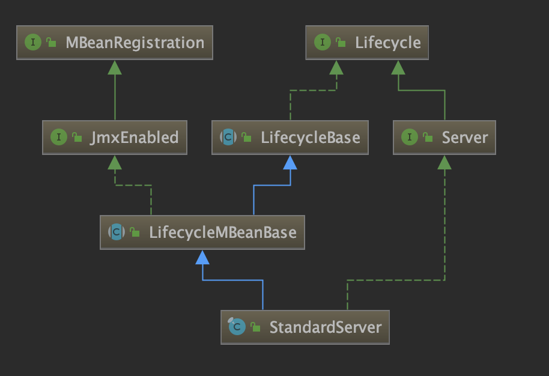	

Server接口的addService(Service)、removeService(Service)添加和删除Service、**Server的init方法和start方法分别循环调用每个Service的init方法和start方法启动所有Service。**

​	**Server默认的实现是StandardServer**，**StandardServer又继承自LifecycleMBeanBase**

​	**LifecycleMBeanBase又继承自LifecycleBase**

​	**LifecycleBase中定义了init和start方法**

​	**LifecycleBase里的init方法和start方法又调用initInternal方法和startInternal方法**，这两个方法都是模版方法，由子类具体实现，

```java
public final synchronized void init() throws LifecycleException {
    if (!this.state.equals(LifecycleState.NEW)) {
        this.invalidTransition("before_init");
    }
    try {
        this.setStateInternal(LifecycleState.INITIALIZING, (Object)null, false);
        this.initInternal();
        this.setStateInternal(LifecycleState.INITIALIZED, (Object)null, false);
    } catch (Throwable var2) {
        ExceptionUtils.handleThrowable(var2);
        this.setStateInternal(LifecycleState.FAILED, (Object)null, false);
    }
}

protected abstract void initInternal() throws LifecycleException;

public final synchronized void start() throws LifecycleException {
  try {
    this.setStateInternal(LifecycleState.STARTING_PREP, (Object)null,false);
    this.startInternal();
    if (this.state.equals(LifecycleState.FAILED)) {
      this.stop();
    } else if (!this.state.equals(LifecycleState.STARTING)) {
      this.invalidTransition("after_start");
    } else {
      this.setStateInternal(LifecycleState.STARTED, (Object)null, false);
    }

protected abstract void startInternal() throws LifecycleException;
```

所以**调用StandardServer的init方法和start方法**会执行**StandardServer自己的initInternal方法和startInternal方法**，里面又分别执行所有的services的init和start方法。

```java
protected void initInternal() throws LifecycleException {
    super.initInternal();
    MBeanFactory factory = new MBeanFactory();
    factory.setContainer(this);
    this.onameMBeanFactory = this.register(factory, "type=MBeanFactory");
    this.globalNamingResources.init();
    for(int i = 0; i < this.services.length; ++i) {
        this.services[i].init();
    }
}
protected void startInternal() throws LifecycleException {
  this.fireLifecycleEvent("configure_start", (Object)null);
  this.setState(LifecycleState.STARTING);
  this.globalNamingResources.start();
  synchronized(this.servicesLock) {
    for(int i = 0; i < this.services.length; ++i) {
      this.services[i].start();
    }

  }
}
```

**StandardServer的await方法**

await方法处理流程，省略了一些处理异常、关闭Socket及对接收到数据处理的代码。

首先判断端口号port，然后根据port的值分为三种处理方法：

 1. port为-2，会直接退出，不进行循环

 2. port为-1，会进入while（！stopAwait）的循环，且内部没有berak跳出的语句，stopAwait标志只有调用了stop方法才会设置为true，所以port为-1时只有在外部调用stop方法才会退出循环

 3. port为其他值，会进入一个while（！stopAwait）循环，同时会在port所在的端口启动一个ServerSocker监听关闭命令，接收到了则使用break跳出循环。

    > ​	这里的端口port和关闭命令shutdown是在conf/server.xml文件中配置Server时设置的。默认设置如下
    >
    > ```xml
    > <!-- server.xml -->
    > <Server port="8005" shutdown="SHUTDOWN">
    > ```
    >
    > ​	这时在8005端口监听"SHUTDOWN"命令，接收到了就会关闭Tomcat，如果不想使用网络命令来关闭服务器可以将端口设置为-1。
    >
    > ​	await方法中从端口接受到数据后还会进行处理，如果接收到的数据中有ASCII码小于32的(ASCII中32以下的为控制符)则从小于32的字符截断并丢弃后面的数据。

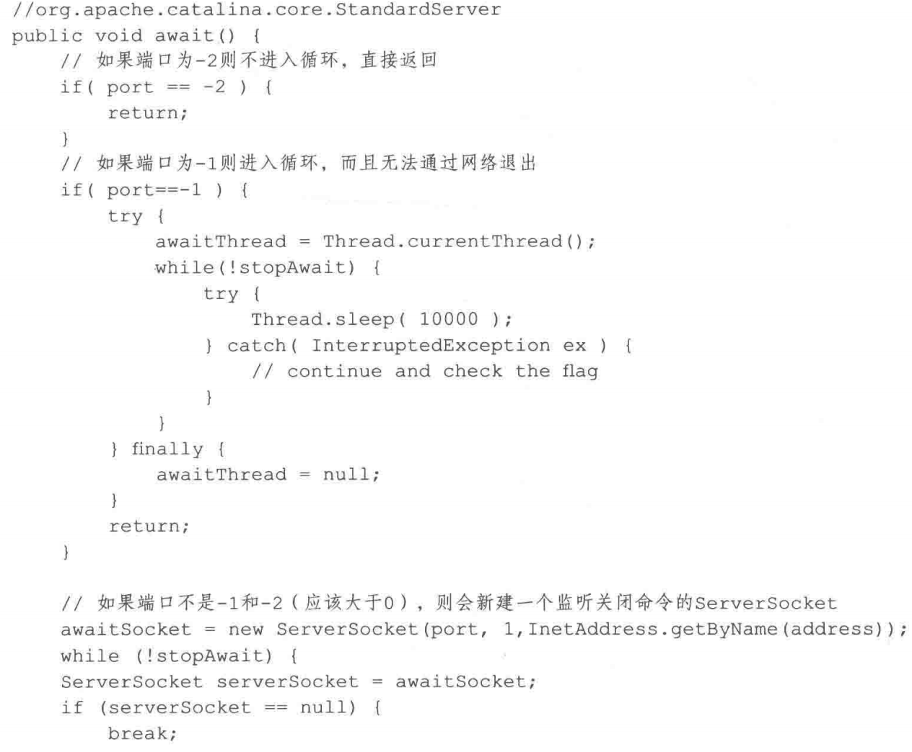

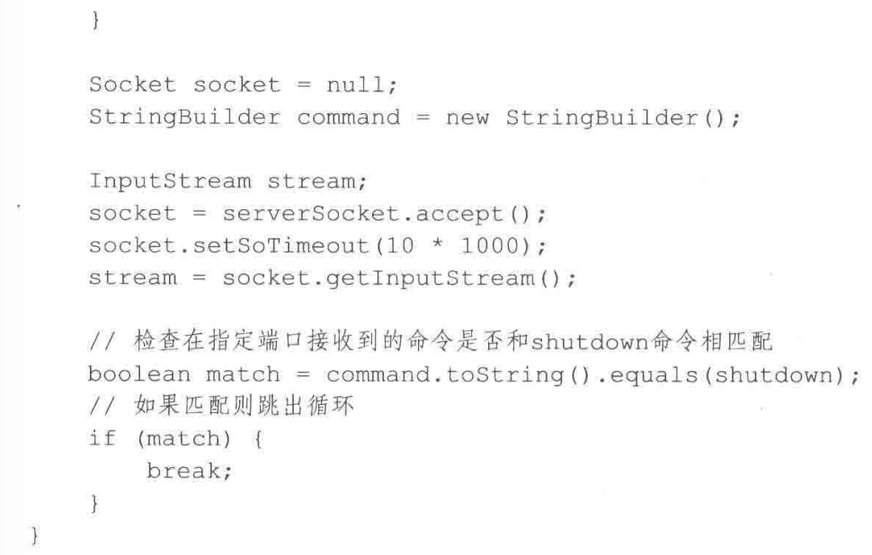


## 1.5 Service的启动过程

**Service默认的实现是StandardService**，**StandardService也继承自LifecycleMBeanBase**，

**StandardService的init方法和start方法最终会执行StandardServer自己的initInternal方法和startInternal方法**

initInternal方法主要调用engine、mapperListener、executor和connector的init方法

> ​	mapperListener是Mapper的监听器，监听container容器的变化，
>
> ​	executors是用在connectors中管理线程的线程池
>
> ​	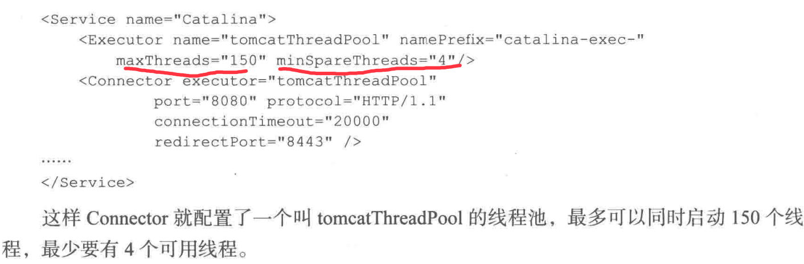

```java
protected void initInternal() throws LifecycleException {
    super.initInternal();
    if (engine != null) {
        engine.init();
    }
    // Initialize any Executors
    for (Executor executor : findExecutors()) {
        if (executor instanceof JmxEnabled) {
            ((JmxEnabled) executor).setDomain(getDomain());
        }
        executor.init();
    }
    // Initialize mapper listener
    mapperListener.init();
    // Initialize our defined Connectors
    synchronized (connectorsLock) {
        for (Connector connector : connectors) {
            connector.init();
        }
    }
}
```

startInternal主要调用engine、mapperListener、executor和connector的start方法

```java
protected void startInternal() throws LifecycleException {
    setState(LifecycleState.STARTING);
    // Start our defined Container first
    if (engine != null) {
        synchronized (engine) {
            engine.start();
        }
    }
    synchronized (executors) {
        for (Executor executor: executors) {
            executor.start();
        }
    }
    mapperListener.start();
    // Start our defined Connectors second
    synchronized (connectorsLock) {
        for (Connector connector: connectors) {
            // If it has already failed, don't try and start it
            if (connector.getState() != LifecycleState.FAILED) {
                connector.start();
            }
        }
    }
}
```

现在整个Tomcat服务器就启动了，整个启动流程

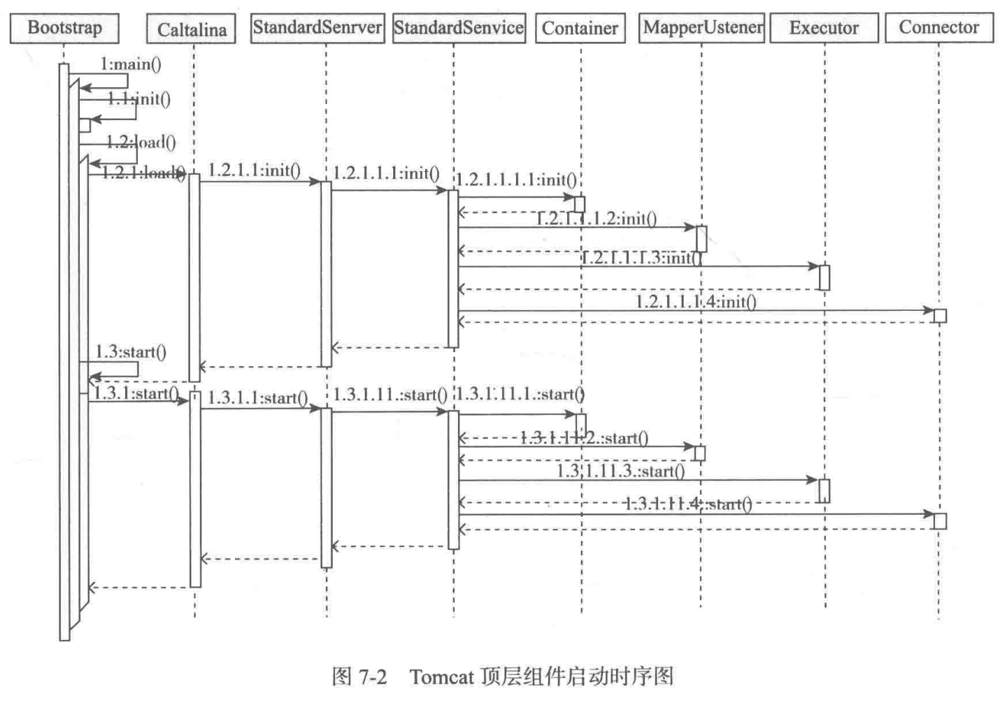

# 2 Tocmat的生命周期管理

## 2.1 Lifecycle 接口

​	Tomcat通过Lifecycle接口统一管理生命周期，所有有生命周期的组件都要实现Lifecycle接口。它一共做了4件事

 1. 定义13个String类型常量，用于LifecycleEvent事件的type属性中，为了区分组件发出的LifecycleEvent事件时的状态(初始化前、启动前、启动中等)。

 2. > ```java
    > public interface Lifecycle {
    >     String BEFORE_INIT_EVENT = "before_init";
    >     String AFTER_INIT_EVENT = "after_init";
    >     String START_EVENT = "start";
    >     String BEFORE_START_EVENT = "before_start";
    >     String AFTER_START_EVENT = "after_start";
    >     String STOP_EVENT = "stop";
    >     String BEFORE_STOP_EVENT = "before_stop";
    >     String AFTER_STOP_EVENT = "after_stop";
    >     String AFTER_DESTROY_EVENT = "after_destroy";
    >     String BEFORE_DESTROY_EVENT = "before_destroy";
    >     String PERIODIC_EVENT = "periodic";
    >     String CONFIGURE_START_EVENT = "configure_start";
    >     String CONFIGURE_STOP_EVENT = "configure_stop";
    >   
    >     void addLifecycleListener(LifecycleListener var1);
    >     LifecycleListener[] findLifecycleListeners();
    >     void removeLifecycleListener(LifecycleListener var1);
    >   
    >     void init() throws LifecycleException;
    >     void start() throws LifecycleException;
    >     void stop() throws LifecycleException;
    >     void destroy() throws LifecycleException;
    > 
    >     LifecycleState getState();
    >     String getStateName();
    >     public interface SingleUse { }
    > ```

2. 定义三个管理监听器的方法addLifecycleListener、findLifecycleEvent和removeLifecycleListener，分别用来添加、查找和删除LifecycleListener类型的监听器

3. 定义4个生命周期的方法：init、start、stop和destroy，用于执行生命周期的各个阶段的操作
4. 定义了获取当前 状态的两个方法getState和getStateName，用来获取当前的状态，getState获取的事枚举类型，里面列举了生命周期的各个节点，getStateName方法返回String类型的状态的名字，用于JMX中。

## 2.2 LifecycleBase

​	Lifecycle默认实现是LifecycleBase，实现了生命周期的组件都直接或间接地继承自LifecycleBase。

* 监听管理使用了LifecycleSupport类来完成，定义了一个LifecycleListener数组类型的属性来保存所有的监听器，然后定义了添加、删除、查找和执行监听器的方法
* 生命周期方法中设置了相应的状态并调用了相应的模版方法，init、start、stop和destroy对应的模版方法分别是initInternal、startInternal、stopInternal和destroyInternal方法，这四个方法由子类具体实现
* 组件当前的状态在声明周期的四个方法中已经设置好了，直接返回

###三个管理监听器的方法

```java
  private LifecycleSupport lifecycle = new LifecycleSupport(this);
    @Override
    public void addLifecycleListener(LifecycleListener listener) {
        lifecycle.addLifecycleListener(listener);
    }
    @Override
    public LifecycleListener[] findLifecycleListeners() {
        return lifecycle.findLifecycleListeners();
    }
    @Override
    public void removeLifecycleListener(LifecycleListener listener) {
        lifecycle.removeLifecycleListener(listener);
    }
```

​	addLifecycleListener、findLifecycleListeners和removeLifecycleListener分别调用了LifecycleSupport中同名的方法，LifecycleSupport监听器是通过一个数组属性listeners保存的

​	这三个方法就是对listeners（数组类型）属性进行操作

* 添加时新建比当前数组大一的数组，将原来的数据按顺序保存进去，将新的添加最后，并将新建的数组赋给listeners属性
* 删除时先找到要删除的监听器在数组中的序号，新建一个比当前小一的数组，将除了要删除的监听器所在的序号的元素按顺序添加进入，最后再赋值给listeners属性

```java
private LifecycleListener listeners[] = new LifecycleListener[0];
private final Object listenersLock = new Object(); // Lock object for changes to listeners
public void addLifecycleListener(LifecycleListener listener) {
  synchronized (listenersLock) {
      LifecycleListener results[] = new LifecycleListener[listeners.length + 1];
      for (int i = 0; i < listeners.length; i++)
          results[i] = listeners[i];
      results[listeners.length] = listener;
      listeners = results;
  }
}
public LifecycleListener[] findLifecycleListeners() {
    return listeners;
}
public void removeLifecycleListener(LifecycleListener listener) {
    synchronized (listenersLock) {
        int n = -1;
        for (int i = 0; i < listeners.length; i++) {
            if (listeners[i] == listener) {
                n = i;
                break;
            }
        }
        if (n < 0)
            return;
        LifecycleListener results[] = new LifecycleListener[listeners.length - 1];
        int j = 0;
        for (int i = 0; i < listeners.length; i++) {
            if (i != n)
                results[j++] = listeners[i];
        }
        listeners = results;
    }
}
```

​	LifecycleSupport中还定义了处理LifecycleEvent实践的fireLifecycleEvent方法，按事件的类型(组件的状态)创建了LifecycleEvent事件，然后遍历所有的监听器进行处理。

```java
public void fireLifecycleEvent(String type, Object data) {
    LifecycleEvent event = new LifecycleEvent(lifecycle, type, data);
    LifecycleListener interested[] = listeners;
    for (int i = 0; i < interested.length; i++)
        interested[i].lifecycleEvent(event);
}
```

### 四个生命周期方法

​	四个声明周期方法的实现首先判断当前的状态和要处理的方法是否匹配，不匹配就会执行相应方法使其匹配(在init之前调用start，start方法里检验状态等，还是会先执行init方法)，或不处理甚至抛出异常，如果匹配或者处理后匹配了，会调用相应的模版方法并设置相应的状态。

####init方法

​	LifecycleBase中的状态是通过LifecycleState类型的state属性来保存的，最开始初始化值为NEW，如果不为NEW会调用invalidTransition方法抛出异常，其他三个方法也会这样

```java
public final synchronized void init() throws LifecycleException {
    //最开始的值必须是NEW，否则会抛出异常
    if (!state.equals(LifecycleState.NEW)) {
        invalidTransition(Lifecycle.BEFORE_INIT_EVENT);
    }
    try {
      //初始化前将状态设置为INITALIZING
        setStateInternal(LifecycleState.INITIALIZING, null, false);
        initInternal();
      //初始化后将状态设置为INITALIZED
        setStateInternal(LifecycleState.INITIALIZED, null, false);
    } catch (Throwable t) {
        ExceptionUtils.handleThrowable(t);
        setStateInternal(LifecycleState.FAILED, null, false);
        throw new LifecycleException(
                sm.getString("lifecycleBase.initFail",toString()), t);
    }
}
```

#### start方法

	1. 通过状态检查是否已经启动，已启动则打印日志并直接返回
 	2. 如果没有初始化则先进性初始化，如果启动失败则关闭，如果状态无法吹了则抛出异常
 	3. 启动前将状态设置为LifecycleState.STARTING_PREP
 	4. 调用模版方法启动组件
 	5. 启动失败将状态设置为FALLED并执行stop方法停止
 	6. 启动状态不是STARTED则抛出异常
 	7. 成功启动后将状态设置为STARTED

```java
public final synchronized void start() throws LifecycleException {
    if (LifecycleState.STARTING_PREP.equals(state) || LifecycleState.STARTING.equals(state) ||
            LifecycleState.STARTED.equals(state)) {
        if (log.isDebugEnabled()) {
            Exception e = new LifecycleException();
            log.debug(sm.getString("lifecycleBase.alreadyStarted", toString()), e);
        } else if (log.isInfoEnabled()) {
            log.info(sm.getString("lifecycleBase.alreadyStarted", toString()));
        }
        return;
    }
    if (state.equals(LifecycleState.NEW)) {
        init();
    } else if (state.equals(LifecycleState.FAILED)) {
        stop();
    } else if (!state.equals(LifecycleState.INITIALIZED) &&
            !state.equals(LifecycleState.STOPPED)) {
        invalidTransition(Lifecycle.BEFORE_START_EVENT);
    }
    try {
        setStateInternal(LifecycleState.STARTING_PREP, null, false);
        startInternal();
        if (state.equals(LifecycleState.FAILED)) {
            stop();
        } else if (!state.equals(LifecycleState.STARTING)) {
            invalidTransition(Lifecycle.AFTER_START_EVENT);
        } else {
            setStateInternal(LifecycleState.STARTED, null, false);
        }
    } catch (Throwable t) {
        setStateInternal(LifecycleState.FAILED, null, false);
    }
}
```

#### stop方法

 	1. 通过状态检查是否已经关闭，已关闭则打印日志并直接返回
 	2. 如果是NEW状态，将当前state设置为STOPPED并返回
 	3. 如果状态不是STARTED也不是FAILED则抛出异常
 	4. 如果当前状态是FAILED则将当前标志为BEFORE_STOP_EVENT事件
 	5. 调用模版方法进行stop
 	6. 停止状态不是STOPPING和FAILED则抛出异常
 	7. 成功启动后将状态设置为STOPPED
 	8. finally里面执行destory方法

```java
public final synchronized void stop() throws LifecycleException {
    if (LifecycleState.STOPPING_PREP.equals(state) || LifecycleState.STOPPING.equals(state) ||
            LifecycleState.STOPPED.equals(state)) {
        if (log.isDebugEnabled()) {
        } else if (log.isInfoEnabled()) {
        }
        return;
    }
    if (state.equals(LifecycleState.NEW)) {
        state = LifecycleState.STOPPED;
        return;
    }
    if (!state.equals(LifecycleState.STARTED) && !state.equals(LifecycleState.FAILED)) {
        invalidTransition(Lifecycle.BEFORE_STOP_EVENT);
    }
    try {
        if (state.equals(LifecycleState.FAILED)) {
            fireLifecycleEvent(BEFORE_STOP_EVENT, null);
        } else {
            setStateInternal(LifecycleState.STOPPING_PREP, null, false);
        }
        stopInternal();
        if (!state.equals(LifecycleState.STOPPING) && !state.equals(LifecycleState.FAILED)) {
            invalidTransition(Lifecycle.AFTER_STOP_EVENT);
        }
        setStateInternal(LifecycleState.STOPPED, null, false);
    } catch (Throwable t) {
        setStateInternal(LifecycleState.FAILED, null, false);
    } finally {
        if (this instanceof Lifecycle.SingleUse) {
            setStateInternal(LifecycleState.STOPPED, null, false);
            destroy();
        }
    }
}
```

#### destory方法

1. 如果LifecycleState状态是FAILED则先执行stop方法
2. 如果状态是DESTROYING或DESTROYED 记录日志并退出
3. 如果状态不是STOPPED、FAILED、NEW、INITIALIZED 抛出异常
4. 销毁前将状态设置为LifecycleState.DESTROYING
 5. 调用模版方法销毁组件
 6. 销毁后将状态设置为DESTROYED

```java
public final synchronized void destroy() throws LifecycleException {
    if (LifecycleState.FAILED.equals(state)) {
        try {
            stop();
        } catch (LifecycleException e) {
        }
   
    if (!state.equals(LifecycleState.STOPPED) &&
            !state.equals(LifecycleState.FAILED) &&
            !state.equals(LifecycleState.NEW) &&
            !state.equals(LifecycleState.INITIALIZED)) {
        invalidTransition(Lifecycle.BEFORE_DESTROY_EVENT);
    }
    try {
        setStateInternal(LifecycleState.DESTROYING, null, false);
        destroyInternal();
        setStateInternal(LifecycleState.DESTROYED, null, false);
    } catch (Throwable t) {
        setStateInternal(LifecycleState.FAILED, null, false);
    }
}
```

#### setStateInternal()

该方法除了设置状态还检查设置的状态合不合逻辑，并在最后发布相应的事件

```java
private synchronized void setStateInternal(LifecycleState state,
        Object data, boolean check) throws LifecycleException {
    if (log.isDebugEnabled()) {
        log.debug(sm.getString("lifecycleBase.setState", this, state));
    }
    if (check) {
        if (state == null) {
            invalidTransition("null");
            return;
        }
        if (!(state == LifecycleState.FAILED ||
                (this.state == LifecycleState.STARTING_PREP &&
                        state == LifecycleState.STARTING) ||
                (this.state == LifecycleState.STOPPING_PREP &&
                        state == LifecycleState.STOPPING) ||
                (this.state == LifecycleState.FAILED &&
                        state == LifecycleState.STOPPING))) {
            invalidTransition(state.name());
        }
    }
    this.state = state;
    String lifecycleEvent = state.getLifecycleEvent();
    if (lifecycleEvent != null) {
        fireLifecycleEvent(lifecycleEvent, data);
    }
}
```

#### fireLifecycleEvent()

处理事件，该方法调用了LifecycleSupport的fireLifecycleEvent方法具体处理

```java
protected void fireLifecycleEvent(String type, Object data) {
    lifecycle.fireLifecycleEvent(type, data);
}
```

#### invalidTransition()

负责抛出指定状态的异常

```java
private void invalidTransition(String type) throws LifecycleException {
    String msg = sm.getString("lifecycleBase.invalidTransition", type,toString(), state);
    throw new LifecycleException(msg);
}
```

###两个获取当前状态的方法

​	在生命周期的相应方法已经将状态设置到了state属性，直接将state返回就可以

```java
public LifecycleState getState() {
    return state;
}
@Override
public String getStateName() {
    return getState().toString();
}
```

# 3 Container分析

## 3.1 ContainerBase的结构

​	Container是Tomcat中容器的接口，通常使用的Servlet就封装在其子接口Wrapper中 。

​	Container一共有四个子接口Engine、Host、Context、Wrapper和一个默认实现类ContainerBase。每个子接口都是一个容器，四个容器都有对应的StandardXX实现类，且这些实现类都继承COntainerBase类。

​	Container还继承Lifecycle接口，且ContainerBase间接继承LifecycleBase，所以Engine、Host、Context、Wrapper这四个子容器都符合Tomcat的生命周期管理模式。

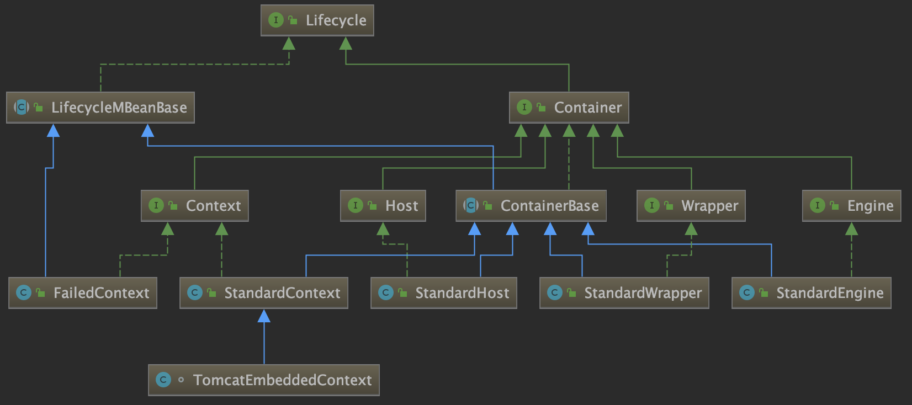

## 3.2 Container的四个子容器

​	Container的子容器Engine、Host、Context、Wrapper是逐层包含的关系，Engine是最顶层，每个service最多只能有一个Engine，Engine里可以有多个Host，每个Host下可以有多个Context，每个Context下可以有多个Weapper。

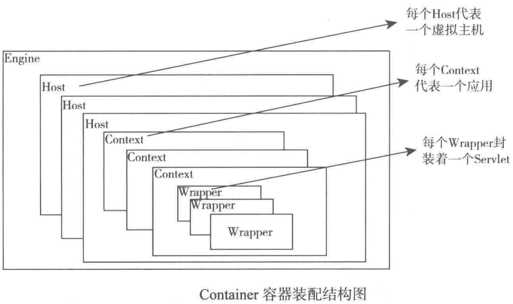

* Engine：引擎，用来管理多个站点，一个Service最多只能有一个Engine
* Host：代表一个站点，也叫虚拟主机，通过配置Host就可以添加站点 /localhost
* Context：代表一个应用程序localhost/test，对应着平时开发的一个程序，或者一个WEB-INF目录及下面的web.xml文件
* Wrapper：每个Wrapper封装着一个Servlet

## 3.3 四种容器的配置方法

### Engine和Host的配置

都在conf/server.xml文件中，server.xml文件是Tomcat中最重要的配置文件，大部分功能都在这配置

* 首先定义Server，8005端口监听关闭命令"SHUTDOWN"
* Server里定义了名为Cataline的Service
* Service定义了两个Connector：HTTP协议和AJP协议(通过AJP协议和另一个web容器进行交互，主要用于集成)
* Service还定义了名为Catalina的Engine
* Engine里定义了名为localhost的Host
  * defaultHost 表示请求的域名如果在所有的Host的name和Alias中都找不到时使用的默认Host，
* Host标签
  * name 表示定义的站点可以通过localhost访问
  * appBase 指定站点的位置，默认在webapps下，
  * unpackWARs 表示是否自动解压war文件
  * autoDeploy 表示是否自动部署（运行中新加入webapp目录的应用会自动部署并启动）

```xml
<?xml version="1.0" encoding="UTF-8"?>
<Server port="8005" shutdown="SHUTDOWN">
  <Service name="Catalina">
    <Connector port="8080" protocol="HTTP/1.1"
               connectionTimeout="20000"
               redirectPort="8443" URIEncoding="UTF-8" />
    <Connector port="8009" protocol="AJP/1.3" redirectPort="8443" />
    <Engine name="Catalina" defaultHost="localhost">
      <Host name="localhost"  appBase="webapps"
            unpackWARs="true" autoDeploy="true">
      </Host>
    </Engine>
  </Service>
</Server>
```
	### Context配置

​	Context有三种配置方法

  1. 通过文件配置，通过文件配置有五个位置可以配置

       1. conf/server.xml文件中的Context标签   只有在Tomcat重启才会重新加载

       2. conf/[enginename]/[hostname]/目录下以应用命令的xml文件

       3. 应用自己的/META-INF/context.xml文件

       4. conf/context.xml文件   配置的内容在整个Tomcat中共享

       5. conf/[enginename]/[hostname]/context.xml.default文件  在对应的host中共享

          前三个用于配置单独的应用，后两个配置的Context是共享的

  2. 将WAR应用直接放到Host的appBase配置的目录下，Tomcat会自动查找并添加到Host中

  3. 将应用的文件夹放到HostHost的appBase配置的目录下，Tomcat也会自动查找并添加到Host中

### Wrapper配置

​	就是在web.xml中配置的Servlet，一个Servlet对应一个Wrapper。

​	也可以在conf/web.xml配置全局的Wrapper，处理Jsp的JspServlet就配置在这里，不需要自己配置Jsp就可以处理Jsp请求了

## 3.4 Container的启动

​	Container启动是通过init和start方法来完成的，这两个方法会在Tomcat启动时被Service调用。

​	Container也是按照Tomcat的生命周期来管理的，init和start方法也会调用initInternal和startInternal方法具体处理，不过Container和Tomcat整体结构启动的过程稍微有些不一样

		1. Container的四个子容器有一个共同的父类ContainerBase，定义了Container容器的initInternal和startInternal方法通用处理内容，具体容器还可以添加自己的内容
  		2. 除了最顶层容器的init被Service调用的，子容器的init方法并不是在容器中逐层循环调用的，而是在执行start方法时通过状态判断还没有初始化才会调用
  		3. start方法除了在父容器的startInternal方法中调用，还会在父容器的添加子容器的addChild方法中调用，主要是因为Context和Wrapper是动态添加的，

###ContainerBase的initInternal

​	该方法主要初始化ThreadPoolExecutor类型的startStopExecutor属性，用于管理启动和关闭的线程。这里并没有设置生命周期的相应状态，所以如果具体容器也没有设置相应生命周期状态，那么即使已经调用init方法进行初始化，在start进行启动前也会再次调用init方法。

> ​	ThreadPoolExecutor继承Executor用于管理线程，特别是Runable类型的线程。

```java
protected void initInternal() throws LifecycleException {
    BlockingQueue<Runnable> startStopQueue =
        new LinkedBlockingQueue<Runnable>();
    startStopExecutor = new ThreadPoolExecutor(
            getStartStopThreadsInternal(),
            getStartStopThreadsInternal(), 10, TimeUnit.SECONDS,
            startStopQueue,
            new StartStopThreadFactory(getName() + "-startStop-"));
    startStopExecutor.allowCoreThreadTimeOut(true);
    super.initInternal();
}
```

###ContainerBase的startInternal

​	该方法主要做了五件事

 1. **如果有cluster和Realm则调用其start方法**

    cluster用于配置集群，作用同步Session；Realm是Tomcat的安全域，同来管理资源的访问权限

 2. **调用所有子容器的start方法启动子容器**

    子容器使用stratStopExecutor调用新线程启动的，这样可以用多个线程同时启动，效率更高，具体是通过for循环对每个子容器启动一个线程，并将返回的Future保存在List中，然后遍历每个Future并调用其get方法。

    > 遍历Future有两个作用：
    >
    > 		1. 其get方法是阻塞的，只有线程处理完后才会向下走，保证了管道pipeline启动前容器已经启动完成了		
    >
    >   		2. 可以处理启动过程中遇到的异常 

 3. **调用管道中Value的start方法来启动管道**

 4. **启动完成后将生命周期状态设置为LifecycleState.STARTING状态**

 5. **启用后台线程定时处理一些事**

    ```java
    protected synchronized void startInternal() throws LifecycleException {
        Loader loader = getLoaderInternal();
        if ((loader != null) && (loader instanceof Lifecycle))
            ((Lifecycle) loader).start();
        getLogger();
        Manager manager = getManagerInternal();
        if ((manager != null) && (manager instanceof Lifecycle))
            ((Lifecycle) manager).start();
        Cluster cluster = getClusterInternal();
        if ((cluster != null) && (cluster instanceof Lifecycle))
            ((Lifecycle) cluster).start();
        Realm realm = getRealmInternal();
        if ((realm != null) && (realm instanceof Lifecycle))
            ((Lifecycle) realm).start();
        DirContext resources = getResourcesInternal();
        if ((resources != null) && (resources instanceof Lifecycle))
            ((Lifecycle) resources).start();
       //获取所有子容器
        Container children[] = findChildren();
        List<Future<Void>> results = new ArrayList<Future<Void>>();
        for (int i = 0; i < children.length; i++) {
            results.add(startStopExecutor.submit(new StartChild(children[i])));
        }
        boolean fail = false;
      //处理子容器 启动线程的Future
        for (Future<Void> result : results) {
            try {
                result.get();
            } catch (Exception e) {
                fail = true;
            }
        }
      //启动管道
        if (pipeline instanceof Lifecycle)
            ((Lifecycle) pipeline).start();
      //将生命周期状态设置为LifecycleState.STARTING
        setState(LifecycleState.STARTING);
      //启动后台线程
        threadStart();
    }
    ```

    ​	启动子容器的线程类型StartChild是实现了Callable的内部类，作用就是调用子容器的start方法

    ```java
    private static class StartChild implements Callable<Void> {
        private Container child;
        public StartChild(Container child) {
            this.child = child;
        }
        @Override
        public Void call() throws LifecycleException {
            child.start();
            return null;
        }
    }
    ```

    ​	threadStart方法启动的后台线程是一个while循环，内部定期调用backgroundProcess方法做些事，间隔时间通过ContainerBase的backgroundProcessorDelay属性来设置，单位事秒，小于0不启动后台线程，其backgroundProcess方法会在父容器的后台线程中调用。

    ​	backgroundProcess方法是Container接口中的一个方法，共有三个实现，分别在ContainerBase、StandardContext和StandardWrapper中，ContainerBase提供了所有容器共同的处理过程。

    > ​	StandardContext和StandardWrapper的backgroundProcess方法除了处理自己相关的业务，也调用ContainerBase中的处理。
    >
    > ​	ContainerBase的backgroundProcess方法调用了Cluster、Realm和管道的backgroundProcess方法
    >
    > ​	StandardContext的backgroundProcess方法中对Session过期和资源变化进行了处理
    >
    > ​	StandardWrapper的backgroundProcess方法对Jsp生成的Servlet定期进行检查

### Engine

​	Service会调用最顶层容器的init和start方法，如果使用了Engine会调用Engine的。Engine的默认实现类StandardEngine中的initInternal和startInternal方法如下

```java
protected void initInternal() throws LifecycleException {
    getRealm();
    super.initInternal();
}
protected synchronized void startInternal() throws LifecycleException {
    super.startInternal();
}
```

​	它们分别调用ContainerBase中的相应方法，initInternal方法还调用了getRealm方法，如果没有配置Realm，则使用一个默认的NullRealm		

```java
public Realm getRealm() {
    Realm configured = super.getRealm();
    if (configured == null) {
        configured = new NullRealm();
        this.setRealm(configured);
    }
    return configured;
}
```

### Host

​	Host的默认实现类StandardHost没有重写initInternal方法，初始化默认调用ContainerBase的initInternal方法。startInternal方法如下，检查Host的管道中有没有指定的value，没有则添加进去。

> ​	检查的value的类型通过getErrorReportValveClass方法获取，它返回errorReportValveClass属性，可以配置，默认是ErrorReportValve
>
> private String errorReportValveClass = "org.apache.catalina.valves.ErrorReportValve"

```java
protected synchronized void startInternal() throws LifecycleException {
    String errorValve = getErrorReportValveClass();
    if ((errorValve != null) && (!errorValve.equals(""))) {
        try {
            boolean found = false;
            Valve[] valves = getPipeline().getValves();
            for (Valve valve : valves) {
                if (errorValve.equals(valve.getClass().getName())) {
                    found = true;
                    break;
                }
            }
            if(!found) {
 								Valve valve =(Valve)Class.forName(errorValve).getDeclaredConstructor().newInstance();
              	//管道中没有ErrorReportValv则将其加入管道
                getPipeline().addValve(valve);
            }
        }
    }
    super.startInternal();
}
```

​	Host的启动除了startInternal方法还有HostConfig中相应的方法，HostConfig继承子LifecycleListener的监听器(Engine对应的EngineConfig监听器只是做了日志记录)，在接受到Lifecycle.START_EVENT事件时会调用start方法启动，HostConfig的start方法会检查配置的Host站点的位置是否存在及是不是目录，最后调用deployApps方法部署应用。

```java
  protected void deployApps() {
        File appBase = appBase();
        File configBase = configBase();
        String[] filteredAppPaths = filterAppPaths(appBase.list());
    		// 部署XML描述文件
        deployDescriptors(configBase, configBase.list());
    		// 部署WAR文件
        deployWARs(appBase, filteredAppPaths);
    		// 部署 文件夹
        deployDirectories(appBase, filteredAppPaths);
    }
```

 * XML文件指conf/[enginename]/[hostname]/*.xml文件

 * WAR文件和文件夹是Host站点目录下的，会自动找出来并部署

   部署后会将部署的Context通过StandardHost的addChild方法添加到Host里面。

   StandardHost的addChild方法会调用父类ContainerBase的addChild方法，其中会调用子类(这里指Context)的start方法来启动子容器

### Context

​	Context的默认实现类StandardContext在startInteral方法中调用了在web.xml定义的Listener，还初始化了其中的Filter和load-on-startup的Servlet

```java
protected synchronized void startInternal() throws LifecycleException {
// 触发listener
if (ok) {
    if (!listenerStart()) {
        log.error(sm.getString("standardContext.listenerFail"));
        ok = false;
    }
}
// 初始化Filter
if (ok) {
     if (!filterStart()) {
       log.error(sm.getString("standardContext.filterFail"));
       ok = false;
     }
   }
// 初始化Servlets
if (ok) {
  if (!loadOnStartup(findChildren())){
    log.error(sm.getString("standardContext.servletFail"));
    ok = false;
  }
}
```

​	listenerStart、filterStart和loadOnStartup方法分别调用配置在Listener的contextInitialized方法及Filter和配置了load-on-startup的Servlet的init方法

​	Context和Host一样也有个LifecycleListener类型的监听器ContextConfig，其中configureStart方法用来处理CONFIGURE_START_CEVENT事件，这个方法里面调用webConfig方法，webConfig方法解析了web.xml文件，相应地创建了Wrapper并使用addChild添加到了Context里面

### Wrapper	

​	Wrapper的默认实现类StandardWrapper没有重写initInternal方法，初始化时会默认调用ContainerBase的initInternal方法

```java
protected synchronized void startInternal() throws LifecycleException {
    if (this.getObjectName() != null) {
        Notification notification = new Notification("j2ee.state.starting",
                                                    this.getObjectName(),
                                                    sequenceNumber++);
        broadcaster.sendNotification(notification);
    }
    super.startInternal();
    setAvailable(0L);
    if (this.getObjectName() != null) {
        Notification notification =
            new Notification("j2ee.state.running", this.getObjectName(),
                            sequenceNumber++);
        broadcaster.sendNotification(notification);
    }
}
```

​	主要做了三件事

 1. 用broadcaster发送通知，用于JMX

 2. 调用了父类ContainerBase中的startInternal方法

 3. 调用setAvaliable方法让Servlet有效

    ​	该方法是Wrapper接口的方法，作用是设置Wrapper所包含的Servlet有效的起始时间，如果设置的是将来的事件，那么调用所对应的Servlet就会产生错误，知道过了所设置的事件后才可以正常调用。

Wrapper没有XXConfig样式的LifecycleListener监听器

# 4 Pipeline-Value管道

​	上一节讲了Container的创建过程，Container处理请求是使用Pipeline-value管道处理的。下面先分析它的处理模式，然后分析实现方法

##4.1 Pipeline-Value处理模式

​	Pipeline-Value是责任链模式，在一个请求处理过程中有多个处理者依次对请求进行处理。

> ​		Pipeline相当于处理请求的路线，Value相当于每个处理者处理的过程

​	Pipeline-Value的管道模型和普通的责任链模式有些不同，区别有两点：

  1. 每个Pipeline都有特定的Value，且在管道的最后一个执行，这个Value叫BaseValue，是不可删除的

  2. 上层容器的管道的BaseValue会调用下层容器的管道。4个容器的BaseValue分别是StandardEngineValve、StandardHostValve、StandardContextValve和StandardWrapperValve。处理流程如下

     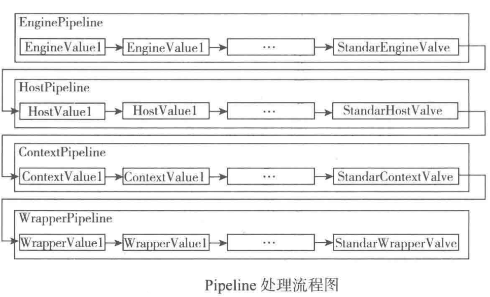

     > ​	Filter中的FilterChain就是这种模式，FilterChain相当于Pipeline，每个Filter相当于一个Value，Servlet相当于对后的BaseValue

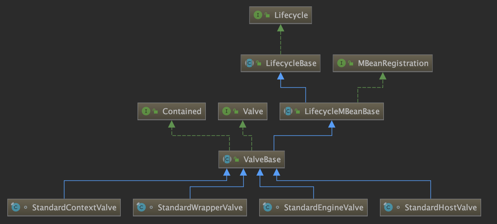

## 4.2 Pipeline-Value的实现方法

​	Pipeline管道的实现分为生命周期管理和处理请求两部分

###Pipeline管道生命周期的实现方法

​	Container中的Pipeline在抽象类ContainerBase中定义，并在生命周期的startInternal、stopInternal、destoryInternal方法中调用管道的相应生命周期方法(因为管道不需要初始化所以initInternal没有调用)

```java
public abstract class ContainerBase extends LifecycleMBeanBase
        implements Container
protected synchronized void startInternal() throws LifecycleException {
		if (pipeline instanceof Lifecycle)
    		((Lifecycle) pipeline).start();
  
protected synchronized void stopInternal() throws LifecycleException {
          if (pipeline instanceof Lifecycle &&
                ((Lifecycle) pipeline).getState().isAvailable()) {
            ((Lifecycle) pipeline).stop();
        }
protected void destroyInternal() throws LifecycleException {
          if (pipeline instanceof Lifecycle) {
            ((Lifecycle) pipeline).destroy();
        }
```

​	Container的四个子容器都继承自ContainerBase，所以四个子容器在执行生命周期的方法时都会调用管道相应的生命周期方法

​	Pipeline使用的是StanardPipeline类型，里面的Value保存在first属性中，Value是链式结构，可以通过getNext方法一次获取每个Value，BaseValue单独保存在basic属性中(basic不能为空，在调用addValve方法添加Value时basic会同时保存到dirst的最后一个，如果没调用addValve方法first可能为空)。

​	StanardPipeline继承子LifecycleBase，实际处理生命周期的方法是startInternal、stopInternal和destoryInternel	

```java
public class StandardPipeline extends LifecycleBase implements Pipeline, Contained {
  protected synchronized void startInternal() throws LifecycleException {
    // 使用临时变量current遍历Value链里的所有Value，如果first为空则使用basic
    Valve current = first;
    if (current == null) {
      current = basic;
    }
    //遍历所有Value并调用start方法
    while (current != null) {
      if (current instanceof Lifecycle)
        ((Lifecycle) current).start();
      current = current.getNext();
    }
    //设置LifecycleState.STARTING状态
    setState(LifecycleState.STARTING);
  }
    protected synchronized void stopInternal() throws LifecycleException {
        setState(LifecycleState.STOPPING);
        Valve current = first;
        if (current == null) {
            current = basic;
        }
        while (current != null) {
            if (current instanceof Lifecycle)
                ((Lifecycle) current).stop();
            current = current.getNext();
        }
    }
		//删除所有的Valve
    protected void destroyInternal() {
        Valve[] valves = getValves();
        for (Valve valve : valves) {
            removeValve(valve);
        }
    }
```

​	getValue方法得到basic在内的所有Value集合

```java
public Valve[] getValves() {
    ArrayList<Valve> valveList = new ArrayList<Valve>();
    Valve current = first;
    if (current == null) {
        current = basic;
    }
    while (current != null) {
        valveList.add(current);
        current = current.getNext();
    }
    return valveList.toArray(new Valve[0]);
}
```

### Pipeline管道处理请求的实现方法

​	pipeline调用所包含Value的invoke方法处理请求，并在BaseValue里又调用了子容器pipeline所包含Value的invoke方法，直到最后调用了Wrapper的Pipeline所包含的BaseValue——StandardWrapperValve。

* Connector接收到请求后调用最顶层容器的pipeline处理

* 顶层容器的Pipeline处理后会在其BaseValue里调用下一层容器的pipeline进行处理，这样就可以 逐层调用所有容器的pipeline进行处理了。

  Engine的BaseValue是StandardEngineValve，它的invoke方法如下

  ​	1. Host事先设置到request中，其他各层容器也会实现设置到request中

  ​	2. 然后将请求传递到Host的管道

  ​	3. Host的BaseValue也会调用Context的pipeline

  ​	4. Context的BaseValue调用Wrapper的pipeline

  ​	5. Wrapper的pipeline最后在其BaseValue(StandardWrapperValve)中创建FilterChain并调用其doFilter方法处理请求

  ​	6. FilterChain包含我们配置的和请求相匹配的Filter和Servlet。它的doFilter方法会依次调用所有Filter的doFilter方法和Servlet的service方法，这样请求就得到了处理

  ```java
  public final void invoke(Request request, Response response)
      throws IOException, ServletException {
      Host host = request.getHost();
      if (host == null) {
          response.sendError
              (HttpServletResponse.SC_BAD_REQUEST,
               sm.getString("standardEngine.noHost", 
                            request.getServerName()));
          return;
      }
      if (request.isAsyncSupported()) {
          request.setAsyncSupported(host.getPipeline().isAsyncSupported());
      }
      host.getPipeline().getFirst().invoke(request, response);
  }
  ```

# 5 Connector分析

​		Connector用于接收请求并将请求封装成Request和Response具体处理，底层使用Socket进行连接，Request和Response是按照HTTP协议来封装的，所以Connector同时实现了TCP/IP协议和HTTP协议。	     

​		Request和Response封装完后交给Container进行处理，Container就是Servlet的容器，Container处理完返回给Connector，最后Connector使用Socket将处理结果返回给客户端，整个请求就处理结束。

## 5.1 Connector的结构

​	Connector中具体是用ProtocolHandler处理请求的，不同的ProtocolHandler代表不同的连接类型。

> ​	Http11Protocol使用普通Socket连接，Http11NioProtocol使用NioSocket连接的
>

​	  ProtocolHandler有三个重要组件：Endpoint、Processor和Adapter。

​		**Endpoint 处理底层Socket的网络连接 —— 实现TCP/IP协议**

​		**Process 将Endpoint接收到的Socket封装成Request —— 实现HTTP协议**

​		**Adapter 用于将封装好的Request交给Container进行具体处理 —— 将请求适配到Servlet容器进行处理**

  	Endpoint的抽象实现AbstractEndpoint里面定义的Acceptor和AsyncTimeout两个内部类和一个Handler接口

​		Acceptor 用于监听请求

​		AsyncTimeout 检查异步request的超时

​		Handler 处理接收到的Socket，在内部调用Process进行处理

​	    

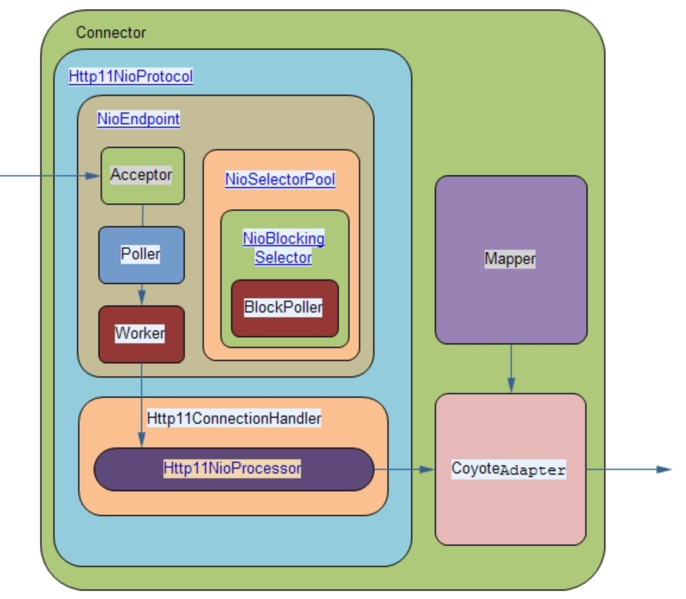

## 5.2 Connector自身类

​	Connector类的作用是为了在它创建时 创建ProtocolHandler，然后在生命周期的相关方法中调用了ProtocolHandler的相关生命周期方法。

​	Connector的使用方法是通过Connector标签配置在conf/server.xml文件中，所以Connector是在Catalina的load方法中根据conf/server.xml配置文件创建Server对象时创建的。Connector的生命周期方法是在Service中调用的。

###Connector的创建

​	Connector的创建过程主要是初始化ProtocolHandler。根据server.xml配置的Connector的protocol属性，会设置到Connector构造函数的参数中，用于指定ProtocolHandler的类型。

> ​	根据protocol参数指定protocolHandlerClassName，根据反射实例化ProtocolHandler并赋值给当前的protocolHandler属性

```java
public Connector(String protocol) {
    setProtocol(protocol);
    try {
        Class<?> clazz = Class.forName(protocolHandlerClassName);
        this.protocolHandler = (ProtocolHandler) clazz.getDeclaredConstructor().newInstance();
    } catch (Exception e) {
    }
}
```

​	setProtocol方法设置了protocolHandlerClassName属性

​	APr是Apache Protable Runtime的缩写，是Apache提供的一个运行时环境，使用它需要安装，Tomcat可以自己检测出来，并使用apr里面的协议。

​	没有安装apr，会根据配置的HTTP/1.1属性将protocolHandlerClassName设置为org.apache.coyote.http11.Http11Protocol

> ```
> tomcat8 默认使用 org.apache.coyote.http11.Http11NioProtocol
> ```

```java
public void setProtocol(String protocol) {
    if (AprLifecycleListener.isAprAvailable()) {
        if ("HTTP/1.1".equals(protocol)) {
            setProtocolHandlerClassName
            ("org.apache.coyote.http11.Http11AprProtocol");
        } else if ("AJP/1.3".equals(protocol)) {
            setProtocolHandlerClassName
            ("org.apache.coyote.ajp.AjpAprProtocol");
        } else if (protocol != null) {
            setProtocolHandlerClassName(protocol);
        } else {
            setProtocolHandlerClassName
            ("org.apache.coyote.http11.Http11AprProtocol");
        }
    } else {
        if ("HTTP/1.1".equals(protocol)) {
            setProtocolHandlerClassName
            ("org.apache.coyote.http11.Http11Protocol");
        } else if ("AJP/1.3".equals(protocol)) {
            setProtocolHandlerClassName
            ("org.apache.coyote.ajp.AjpProtocol");
        } else if (protocol != null) {
            setProtocolHandlerClassName(protocol);
        }
    }
}
```

### Connector生命周期处理方法

​	主要调用了ProtocolHandler的相应生命周期方法

```java
public class Connector extends LifecycleMBeanBase
  
protected void initInternal() throws LifecycleException {
    super.initInternal();
  	//新建adapter，并设置到protocolHandler
    adapter = new CoyoteAdapter(this);
    protocolHandler.setAdapter(adapter);
    if( null == parseBodyMethodsSet ) {
        setParseBodyMethods(getParseBodyMethods());
    }
    try {
        protocolHandler.init();
    } catch (Exception e) {
    }
    // 初始化Initialize mapper listener
    mapperListener.init();
}

protected void startInternal() throws LifecycleException {
  //判断端口小于0抛出异常
   if (getPort() < 0) {
            throw new LifecycleException(sm.getString(
                    "coyoteConnector.invalidPort", Integer.valueOf(getPort())));
        }
  setState(LifecycleState.STARTING);
  	try {
    protocolHandler.start();
  } catch (Exception e) {
  }
  mapperListener.start();
}

 protected void stopInternal() throws LifecycleException {
        setState(LifecycleState.STOPPING);
        try {
            protocolHandler.stop();
        } catch (Exception e) {
        }
        mapperListener.stop();
    }

protected void destroyInternal() throws LifecycleException {
  		//调用MapperListener的destory方法
        mapperListener.destroy();
        try {
          //调用protocolHandler的destory方法
            protocolHandler.destroy();
        } catch (Exception e) {
        }
        if (getService() != null) {
           //将当前的Connector从service中删除
            getService().removeConnector(this);
        }
  		 //调用父类的destoryInternel方法
        super.destroyInternal();
    }
```

##5.3 ProtocolHandler

​	Tomcat的ProtocolHandler的继承结构图

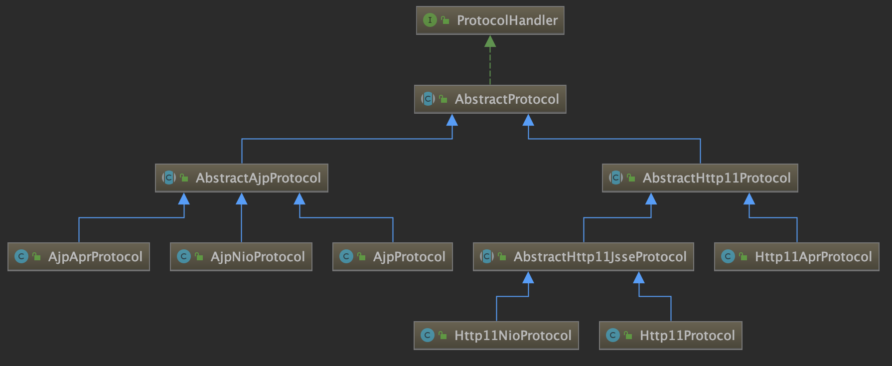

​	ProtocolHandler有一个抽象实现类AbstractProtocol，下面分了两类

	1. AbstractAjpProtocol	又分为AjpApr、AjpNio和Ajp协议
 	2. AbstractHTTP11Protocol 分为AbstractHttp11jsse（Http11Nio和Http11）、Http11Apr

​	Http11Nio的构造函数中创建了NioEndpoint类型的Endpoint，并新建了Http11ConnectionHandler类型的Handler然后设置到了Endpoint

```java
public class Http11NioProtocol extends AbstractHttp11JsseProtocol<NioChannel> {
    public Http11NioProtocol() {
        endpoint=new NioEndpoint();
        cHandler = new Http11ConnectionHandler(this);
        ((NioEndpoint) endpoint).setHandler(cHandler);
        setSoLinger(Constants.DEFAULT_CONNECTION_LINGER);
        setSoTimeout(Constants.DEFAULT_CONNECTION_TIMEOUT);
        setTcpNoDelay(Constants.DEFAULT_TCP_NO_DELAY);
    }
```

​	四个生命周期方法是在父类AbstractProtocol中实现的，主要调用了Endpoing的生命周期方法。

## 5.4 处理TPC/IP协议的Endpoint

​	Endpoint用于处理具体连接和传输数据，NioEndpoint继承子AbstractEndpoing，在NioEndpoint中新增了Poller和SocketProcessor内部类

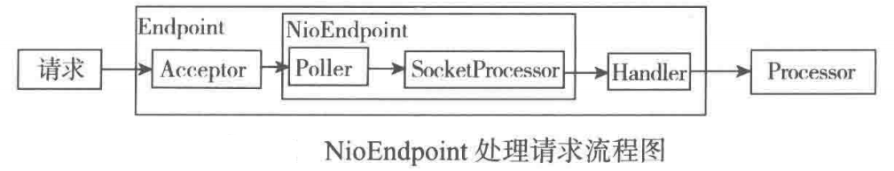	

​	NioEndpoint的init和start方法在父类AbstractEndpoint中

```java
public abstract class AbstractEndpoint<S> {
public void init() throws Exception {
    if (this.bindOnInit) {
        this.bind();
        this.bindState = AbstractEndpoint.BindState.BOUND_ON_INIT;
    }
}
public final void start() throws Exception {
    if (this.bindState == AbstractEndpoint.BindState.UNBOUND) {
        this.bind();
        this.bindState = AbstractEndpoint.BindState.BOUND_ON_START;
    }
    this.startInternal();
}
```

​	这两个方法主要调用bind和startInternal方法，他们是模版方法，在NioEndpoint中实现

> ​		acceptor用于接收请求，然后交给poller处理

```java
public class NioEndpoint extends AbstractEndpoint<NioChannel> {

public void bind() throws Exception {
    serverSock = ServerSocketChannel.open();
    socketProperties.setProperties(serverSock.socket());
    InetSocketAddress addr = (getAddress()!=null?new InetSocketAddress(getAddress(),getPort()):new InetSocketAddress(getPort()));
    serverSock.socket().bind(addr,getBacklog());
    serverSock.configureBlocking(true); //mimic APR behavior
    serverSock.socket().setSoTimeout(getSocketProperties().getSoTimeout());
		//	初始化需要启动accrptor线程的个数，为0则改为1，否则不能工作
    // Initialize thread count defaults for acceptor, poller
    if (acceptorThreadCount == 0) {
        // FIXME: Doesn't seem to work that well with multiple accept threads
        acceptorThreadCount = 1;
    }
  	// 初始化需要启动poller的线程个数，<=0 改为1
    if (pollerThreadCount <= 0) {
        //minimum one poller thread
        pollerThreadCount = 1;
    }
    stopLatch = new CountDownLatch(pollerThreadCount);
    // Initialize SSL if needed 是否需要初始化SSL
    if (isSSLEnabled()) {
        SSLUtil sslUtil = handler.getSslImplementation().getSSLUtil(this);

        sslContext = sslUtil.createSSLContext();
        sslContext.init(wrap(sslUtil.getKeyManagers()),
                sslUtil.getTrustManagers(), null);

        SSLSessionContext sessionContext =
            sslContext.getServerSessionContext();
        if (sessionContext != null) {
            sslUtil.configureSessionContext(sessionContext);
        }
        // Determine which cipher suites and protocols to enable
        enabledCiphers = sslUtil.getEnableableCiphers(sslContext);
        enabledProtocols = sslUtil.getEnableableProtocols(sslContext);
    }

    if (oomParachute>0) reclaimParachute(true);
    selectorPool.open();
}

  public void startInternal() throws Exception {
        if (!running) {
            running = true;
            paused = false;
            // Create worker collection 创建Executor
            if ( getExecutor() == null ) {
                createExecutor();
            }
            initializeConnectionLatch();
            // Start poller threads 启动poller线程
            pollers = new Poller[getPollerThreadCount()];
            for (int i=0; i<pollers.length; i++) {
                pollers[i] = new Poller();
                Thread pollerThread = new Thread(pollers[i], getName() + "-ClientPoller-"+i);
                pollerThread.setPriority(threadPriority);
                pollerThread.setDaemon(true);
                pollerThread.start();
            }
           //启动acceptor线程
            startAcceptorThreads();
        }
    }
```

​	startAcceptorThreads方法，getAcceptorThreadCount()是获取的init方法中处理过的acceptorThreadCount属性，然后启动相应数量的Acceptor线程来接收请求。

```java
protected final void startAcceptorThreads() {
    int count = getAcceptorThreadCount();
    acceptors = new Acceptor[count];
    for (int i = 0; i < count; i++) {
        acceptors[i] = createAcceptor();
        String threadName = getName() + "-Acceptor-" + i;
        acceptors[i].setThreadName(threadName);
        Thread t = new Thread(acceptors[i], threadName);
        t.setPriority(getAcceptorThreadPriority());
        t.setDaemon(getDaemon());
        t.start();
    }
}
```

## 5.5 处理HTTP协议的Processor

​	Processor用于处理应用层协议(如HTTP)，有两个AbstractProcessor抽象类，分别在coyote包和upgrade包。(左边和右边)，右边是Servlet3.1后新增的，用于处理HTTP的升级协议。

> ​	如http升级WebSocket协议，当正常的Processor处理后如果Socket状态是UPGRADING，那么Endpoint中的Handler将会接着创建并调用upgrade包中的processor进行处理。

​	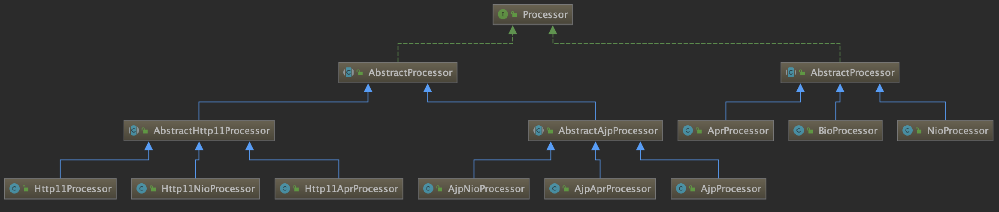

​	coyote包中的Processor和前面的ProtocolHandler对应，具体实现层协议处理请求的是AbstractAjpProcess和AbstractHttp11Processor中的process方法，这个方法首先封装了Request和Response，然后调用Adapter将请求传递到了Container中，最后对处理的结果进行处理，如有没有启动异步处理、处理过程中有没有抛出异常。

## 5.6 适配器Adapter

​	Adapter只有一个实现类，就是connector包下的CoyoteAdapter类。

​	Processor在process方法中会调用Adapter的sevice方法处理请求

​		Adapter的service方法主要调用Container管道中的invoke方法处理请求

​		处理前对Request和Response做了处理，将原来创建的coyote包下的Request和Response封装成connector的Request和Response，并在处理完成后判断是否启动了Comet(长连接模式)和是否启动了异步模式，并作出相应处理。

​		调用Container管道的相应代码

```java
public class CoyoteAdapter implements Adapter {
public void service(org.apache.coyote.Request req,
                    org.apache.coyote.Response res)
    throws Exception {

    Request request = (Request) req.getNote(ADAPTER_NOTES);
    Response response = (Response) res.getNote(ADAPTER_NOTES);

    if (request == null) {

        // Create objects
        request = connector.createRequest();
        request.setCoyoteRequest(req);
        response = connector.createResponse();
        response.setCoyoteResponse(res);

        // Link objects
        request.setResponse(response);
        response.setRequest(request);

        // Set as notes
        req.setNote(ADAPTER_NOTES, request);
        res.setNote(ADAPTER_NOTES, response);

        // Set query string encoding
        req.getParameters().setQueryStringEncoding
            (connector.getURIEncoding());
              req.getRequestProcessor().setWorkerThreadName(Thread.currentThread().getName());
            postParseSuccess = postParseRequest(req, request, res, response);
            if (postParseSuccess) {
                //check valves if we support async
                request.setAsyncSupported(connector.getService().getContainer().getPipeline().isAsyncSupported());
                // Calling the container
                connector.getService().getContainer().getPipeline().getFirst().invoke(request, response);
```

​	这里首先从Connector中获取Service(Connector在initInternal方法中创建CoyoteAdapter时将自己设置到了CoyoteAdapter中)，

​	然后Service中获取Container，接着获取管道的第一个Value，最后调用invoke方法执行请求。

​	Service中保存的是最顶层的容器，当调用最顶层容器管道的invoke方法时，管道将逐层调用各层容器管道中的Value的invoke方法，知道最后调用Wrapper的管道中的BaseValue(StandardWrapperValve)来处理Filter和Servlet。

